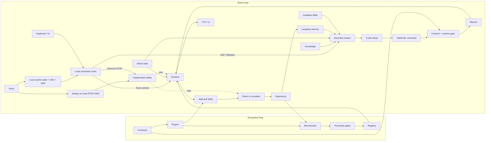

# Longship

**A contracts-first, plugin-driven open robotics project for capabilities that
can grow without losing clarity, reliability, or safety.**

> **Status:** Foundation stage. The repository now includes an independently
> authored, experimental voice-tour V0 on a mock target and a testable Jackie
> wake/dictation boundary. These are contract and runtime-learning slices, not
> claims of autonomous navigation, production speech, or real-hardware
> qualification.

Longship is an independent open-source project for building practical,
reusable capabilities for embodied machines. It is designed for small teams
with long horizons: move lightly, learn quickly, build together, and keep
improving.

## The Longship Spirit

**Explore. Learn. Build together. Keep evolving.**

- **Explore** — test ideas in the real world and stay open to better routes.
- **Learn** — treat success and failure as evidence, and document both honestly.
- **Build together** — use open foundations and stable interfaces so others can
  contribute without starting over.
- **Keep evolving** — prefer cumulative capability over isolated demonstrations.

The goal is not to present a robot that appears finished. The goal is to build
a system that can keep learning while remaining understandable, testable, and
safe.

## What We Are Building

Longship aims to connect six things that robotics projects often treat
separately:

1. **Knowledge** — what the system believes and where that information came
   from.
2. **Missions** — what should be achieved, under which constraints.
3. **Skills** — reusable, bounded robot capabilities.
4. **World state** — a versioned view of the robot and its environment.
5. **Experience** — structured evidence from execution, failure, and recovery.
6. **Evaluation** — reproducible tests and gates for capability promotion.

When high-level AI is enabled, Longship's public reference path uses **Codex
as the Brain**. Longship's context builder supplies Codex with a bounded
snapshot of knowledge, Longship-owned memory, world state, and currently
available Skills. The runtime treats Codex's result as an untrusted high-level
proposal. The V0 implementation currently sends only authoritative tour state
and its action allowlist. Fixed controls and every stop path bypass Codex.

Collecting more data is not enough. Physical intelligence needs a disciplined
path from context to action, from action to evidence, and from evidence to a
safer next capability.

## Two Connected Loops



The **scene loop** shows the target architecture rather than claiming every
node is implemented in V0. It is intended to turn a real task into structured
experience.
Codex is the reference high-level Brain, not the owner of robot state, memory,
audio transport, or actuator authority. The **ecosystem loop** lets people
contribute compatible contracts, plugins, and benchmarks without coupling the
project to one underlying model, simulator, or robot.

The detailed [System Architecture v2](docs/architecture/system-architecture-v2.md)
proposal adds deterministic keyboard and reserved-voice controls that bypass
LLMs, parallel resource-safe Skills such as speaking while moving, role-scoped
concurrent model sessions with transactional handoff, cross-embodiment
adapters, human-readable announcements, live observability, and evidence-gated
evolution.

The companion [Skills and Runtime boundary](docs/architecture/skills-and-runtime.md)
defines where semantic Skills, navigation providers, target adapters, Runtime,
and Safety belong. In short, Runtime schedules capabilities; it does not absorb
their algorithms.

## Run the Experimental Voice Tour

The first executable vertical slice uses console input as an ASR boundary,
console output as TTS, and deterministic mock navigation:

```bash
python -m venv .venv
. .venv/bin/activate
pip install -e .
longship-tour scenarios/voice_tour/tour.zh-CN.json
```

The core also includes a provider-neutral Jackie voice session controller and
deterministic mock input. It accepts ordinary final transcripts only after a
matching `Jackie` wake event, while every partial transcript and unawakened
final transcript is restricted to the local safety-only route. This lets a
reserved `stop` / `停止` overtake a slow Brain call without treating the wake
phrase as authorization. See the [Jackie voice-input guide](docs/guides/jackie-voice-input-v0.md).

No real microphone, wake model, ASR model, or TTS engine is activated by this
repository. The reserved
[`jackie_sherpa_onnx`](plugins/speech/voice_inputs/jackie_sherpa_onnx/)
integration records the intended local plugin and external-artifact boundary.

Commands such as `stop` / `停止`, pause, resume, next, status, and cancel are
routed locally without Codex. Travel speech can overlap mock motion, while
curated narration waits for arrival evidence. Unrecognised final text may use
the optional, non-actuating Codex SDK provider (local app-server, not offline
model inference):

```bash
pip install -e '.[codex]'
longship-tour scenarios/voice_tour/tour.zh-CN.json --brain codex
```

The selected Codex model can be set explicitly at launch:

```bash
longship-tour scenarios/voice_tour/tour.zh-CN.json \
  --brain codex \
  --codex-model gpt-5.6-terra
```

Model access and context size depend on the current account and selected model.
The official [Codex SDK](https://learn.chatgpt.com/docs/codex-sdk) can run a
persistent thread with an explicit model, but its Python interface is not the
robot's microphone or speaker transport. [ChatGPT Voice](https://learn.chatgpt.com/docs/features/voice)
in the desktop app is a separate GPT-Live-powered product layer. Longship
therefore keeps local VAD/ASR, reserved commands, TTS, and durable memory
outside Codex.

See the [scenario instructions](scenarios/voice_tour/README.md) and the
[runtime and extension guide](docs/guides/voice-tour-v0.md). The included
Unitree G1 wrapper is disabled by default and is not connected to this mock
scenario; it establishes a bounded target seam for supervised future work.

## Contracts First

Longship will stabilize public protocols before expanding implementations.
Planned core contracts include:

| Contract | Purpose |
| --- | --- |
| `KnowledgeArtifact` | A claim with scope, provenance, and review status |
| `MissionContract` | A task, constraints, success criteria, and safety bounds |
| `SessionContract` | Runtime scope, participants, resources, and lifecycle |
| `SkillContract` | A capability interface, inputs, outputs, and cancellation semantics |
| `WorldStateSnapshot` | A timestamped, internally consistent view of the world |
| `RuntimeControlCommand` | A deterministic pause, resume, cancel, status, speed, or mode command that bypasses Brain providers |
| `SafetyStopRequest` | A protective-stop request on the local Safety path; physical E-stop remains independent |
| `MissionTaskGraph` | A parallel DAG with resources, barriers, preemption, and cancellation |
| `MissionTaskGraphPatch` | A typed, version-bound update to pending graph structure |
| `ModelSessionLock` | Immutable role-scoped model bindings and handoff policy |
| `CommandEnvelope` | A bounded target command with ownership, validity, and expiry |
| `ExperienceEpisode` | Context, actions, outcomes, failures, recovery, and evidence |
| `EvaluationResult` | Reproducible metrics, target scope, and gate decisions |
| `ArtifactManifest` | Version, hash, provenance, compatibility, and storage location |

Every public schema will carry an explicit version and follow semantic
versioning. Implementations may change; contracts should change deliberately.

## Repository Strategy

The first releases will use **one public monorepo**. This keeps contracts,
runtime behavior, plugin compatibility, scenarios, and tests synchronized while
the architecture is still evolving. Components should move to separate
repositories only when they have independent maintainers and release cycles.

Planned layout:

```text
longship/
├── src/longship/
│   ├── contracts/
│   ├── audio/
│   ├── navigation/
│   ├── knowledge/
│   ├── context/
│   ├── runtime/
│   ├── world/
│   ├── experience/
│   ├── evolution/
│   ├── evaluation/
│   ├── registry/
│   └── sdk/
├── plugins/
│   ├── brains/
│   ├── skills/
│   ├── navigation/
│   ├── speech/
│   ├── policies/
│   ├── targets/
│   └── evaluators/
├── scenarios/
│   ├── voice_tour/
│   └── warehouse_box/
├── schemas/
├── benchmarks/
├── docs/
├── tools/
└── tests/
```

Most of this tree remains a roadmap, not a claim that every component already
exists. The voice-tour V0 intentionally implements only the seams documented in
its guide.

## Plugin Model

The core must stay independent of any specific model provider, training
framework, simulator, sensor vendor, or robot manufacturer.

Planned plugin types:

- **Brain adapters** propose high-level skills and arguments.
- **Knowledge sources** ingest public or user-authorized information with
  provenance.
- **Skills** implement bounded, cancellable capabilities.
- **Policy adapters** translate between stable contracts and model-specific
  inputs or outputs.
- **Target adapters** connect the runtime to a simulator or robot.
- **Evaluators** produce reproducible results for a defined target and scenario.

Each plugin will declare its API version, compatible contracts, supported
targets, maturity level, and artifact hashes in a machine-readable manifest.

## Safety and Control Boundaries

- High-level AI may propose and sequence skills; it must not directly command
  joints, torques, actuators, or safety overrides.
- The runtime validates versioned contracts and owns arbitration, cancellation,
  timeouts, execution monitoring, and recovery.
- Target adapters are the only components allowed to translate approved
  commands into target-specific actions.
- An independent safety layer must be able to veto commands and stop a target
  without depending on a foundation model or network connection.
- Experience may generate candidate lessons, but candidates cannot
  automatically become trusted knowledge or production behavior.
- Evolution tools may create and test candidates; they cannot promote
  themselves onto real hardware.

## Scenario Packs

Scenario packs are end-to-end examples that connect knowledge, missions,
skills, targets, experience, and evaluation. A pack may contain:

- synthetic or license-compatible knowledge examples,
- mission and skill-composition definitions,
- simulation assets and test scenarios,
- evaluation metrics and promotion gates, and
- small success and failure episodes for replay.

The first runnable pack is the experimental **voice tour V0** on a mock target.
The broader planned reference pack is **warehouse box handling**, which will
also begin with mock execution and deterministic evaluation before any
hardware-specific integration.

## Artifact Policy

Git is for source, schemas, manifests, hashes, documentation, and small
license-compatible examples.

| Keep in Git | Store externally |
| --- | --- |
| Schemas and interfaces | Model weights |
| Artifact manifests and hashes | Videos and image sequences |
| Reproducible scripts | Point clouds and robot logs |
| Small curated examples | Large datasets and simulation outputs |
| Evaluation summaries | Large maps and binary artifacts |

External artifacts must have a content hash, provenance, license, compatible
contract version, and stable URI recorded in an `ArtifactManifest`. Git LFS may
be used for small examples, but it is not the primary model or dataset store.

## Capability Promotion

Qualification is recorded separately for each target. All capabilities should
advance through the gates that apply to that target:

```text
Draft
  → Unit tested
  → Replay qualified
  ├→ Mock target qualified
  ├→ Simulation target qualified
  └→ Protected real-world test → Real-hardware target qualified
```

A skill must not run on a target for which it has not passed the corresponding
gate. Real-robot tests are not part of public CI; public schemas can still make
their qualification criteria and reports reviewable.

## Roadmap

### Foundation — now

- Publish the mission, architecture, clean-room rules, and contribution process.
- Establish the monorepo, Apache-2.0 license, and public design discussions.
- Define the initial contract and plugin-manifest proposals.

### Phase 1 — minimal open runtime

- Versioned contracts and JSON Schema examples.
- Plugin SDK and compatibility checks.
- Mock target and deterministic end-to-end benchmark.
- Reference safe-stop skill.
- Warehouse scenario manifest and replayable sample episodes.

### Phase 2 — knowledge and experience

- Knowledge ingestion with provenance.
- Deterministic context compilation.
- Experience recording and failure classification.
- Additional simulation and target adapters.

### Phase 3 — evaluated evolution

- Curriculum and candidate generation.
- Multi-model and multi-target benchmarks.
- Evidence-based promotion and rollback workflows.

Dates will follow working, reviewable capabilities—not the other way around.

## Clean-Room Commitment

Longship accepts only material that contributors have the right to publish.
Do not contribute:

- confidential information from an employer, client, or research partner;
- proprietary source code, models, weights, datasets, CAD files, or documents;
- internal logs, credentials, infrastructure details, or private test results;
- content copied from a private project; or
- third-party material without a compatible license and clear attribution.

Contributions must be created specifically for Longship or derived from clearly
identified, license-compatible public sources. When in doubt, leave it out and
open a design discussion instead.

## Contributing

Early contributions are especially valuable in contract design, plugin
boundaries, scenario definitions, deterministic evaluation, safety review, and
documentation. Please read [CONTRIBUTING.md](CONTRIBUTING.md) and open an issue
before starting a large implementation.

## License

Longship is licensed under the [Apache License 2.0](LICENSE).

---

Longship is not trying to be the biggest ship. It is building to travel far.
