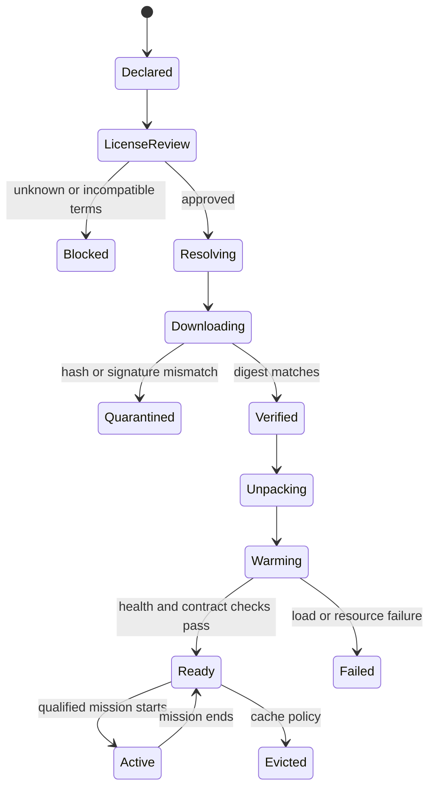

# Model, Framework, and Artifact Integration

> **Status:** Draft design proposal. This document defines a clean-room adapter
> boundary. It does not vendor, mirror, download, or redistribute any upstream
> source, checkpoint, dataset, container, credential, or private robot asset.

## Implementation snapshot (2026-08-24)

The repository now implements the smallest reusable part of this proposal:

- `longship.policies` deep-freezes request payloads and defines untrusted action
  candidates, deadline handling, live lease-epoch fencing, resource-scope
  checks, action-shape checks, explicit bounds, freshness, and identity
  correlation;
- `longship.artifacts` strictly validates external artifact manifests, verifies
  exact size and SHA-256 through no-follow file descriptors, and atomically
  publishes approved bytes into a private content-addressed cache. Approval is
  a separate trusted-registry input; byte transport and live mission state are
  injected by the deployment layer, and no general network downloader ships in
  this slice; and
- the Unitree RL MJLab G1 velocity-v0 seam validates its exact 98-value input,
  29-value output, 20 ms horizon, and whole-body lease using an injected runner
  and synthetic tests.

This is an integration contract, not deployed locomotion. The official Unitree
and Holosoma artifacts remain blocked pending weight-license review and a
simulator-only low-level target. Their side-effect-free observation/action
seams can be tested with injected runners, while GR00T remains a pinned
reference plugin because its public materials do not yet establish complete,
reviewed artifact, timing, mapping, and target-qualification locks. No adapter
here opens DDS, invokes a robot SDK, downloads during a mission, or commands
joints.

## 1. The short answer

Large models do not belong in the Longship Git repository.

Longship stores the small, reviewable integration surface:

- stable contracts and adapter source;
- plugin and artifact manifests;
- target and modality configuration;
- upstream revision and license metadata;
- immutable artifact URIs, sizes, and content hashes;
- mock backends and conformance tests; and
- compact evaluation and qualification reports.

External systems store the heavy or access-controlled material:

- model weights and policy checkpoints in an official model registry or
  governed object store;
- runtime and training images in an OCI registry by digest;
- datasets, video, telemetry, and simulation outputs in artifact storage; and
- tokens and credentials in a secret manager or deployment environment.

Git remains the source of truth for *what is approved*. An artifact registry is
the source of bytes. A runtime cache is the source used for execution.

## 2. Do not call every dependency a model

| Example | Longship role | What it contributes | What it must not become |
| --- | --- | --- | --- |
| Codex agent with an explicitly recorded model | `brain` or `dialogue` provider | Goal interpretation, task draft, explanation, recovery proposal, or conversation | An ASR/TTS transport, durable memory store, joint/velocity controller, or safety authority |
| Whisper, SenseVoice, or another qualified recognizer | `asr` provider | Speech segments or reserved-command candidates | A safety-rated emergency-stop device |
| CosyVoice or another synthesizer | `tts` provider | Asynchronous speech output behind the Audio Arbiter | A dependency of stopping or control progress |
| A detector, tracker, or VLM | `perception` provider | Versioned observations and scene interpretation | An unvalidated world-state authority |
| [NVIDIA Isaac GR00T](https://github.com/NVIDIA/Isaac-GR00T) | `vla_policy` adapter | Multimodal policy inference behind a bounded Skill contract | A direct, unvalidated target command source |
| [Unitree UnifoLM-VLA](https://github.com/unitreerobotics/unifolm-vla) | `vla_policy` adapter | Manipulation policy training and server-side inference | A bundled or automatically commercial-approved policy |
| [Holosoma](https://github.com/amazon-far/holosoma) | `locomotion_policy` or `whole_body_tracking` framework adapter | Training, checkpoint production, inference, retargeting, and deployment tools | A monolithic dependency or universal target qualification |
| [Unitree official SDKs](https://github.com/unitreerobotics) | `target` adapter | Robot state, command transport, frames, capabilities, and target limits | A foundation model or portable policy by itself |

A framework, model architecture, checkpoint, processor, runtime image, target
SDK, robot description, adapter, and target qualification are separate
identities. If an upstream Unitree policy checkpoint is used, it is registered
separately from the Unitree target adapter with independent versions, licenses,
hashes, and qualification results.

Names above identify optional integration families, not endorsements, bundled
dependencies, or claims of compatibility. Every exact revision is reviewed
again when a plugin is implemented.

Codex is Longship's public reference Brain, but "Codex" and the selected model
are separate identities. A deployment records the Codex adapter/runtime
version, model ID, account/deployment scope, context policy, and decision ID.
Maximum context is model-dependent and does not replace Longship-owned memory
or retrieval. Desktop ChatGPT Voice is not treated as the robot's Codex SDK
audio interface; robot ASR and TTS remain independent plugins.

## 3. Proposed repository shape

```text
plugins/
├── brains/
│   └── <provider>/
│       ├── plugin.yaml
│       ├── adapter/
│       ├── MODEL_CARD.md
│       ├── THIRD_PARTY.md
│       └── tests/mock/
├── policies/
│   └── groot/
│       ├── plugin.yaml
│       ├── adapter/
│       ├── modality/
│       ├── model-artifacts.yaml
│       ├── THIRD_PARTY.md
│       └── tests/mock/
├── locomotion/
│   └── holosoma/
│       ├── plugin.yaml
│       ├── adapter/
│       ├── target-config/
│       ├── model-artifacts.yaml
│       ├── THIRD_PARTY.md
│       └── tests/mock/
└── targets/
    └── unitree/
        ├── plugin.yaml
        ├── adapter/
        ├── capability-manifests/
        ├── THIRD_PARTY.md
        └── tests/mock/
```

This is a logical layout. Directories are created only when independently
authored adapter code and maintainers exist. Longship does not copy an upstream
repository into a plugin directory.

## 4. Two manifests and two locks

### 4.1 Plugin manifest

The plugin manifest describes executable integration code:

- plugin ID, version, kind, and Longship API range;
- adapter entry point and optional dependency group;
- input and output contracts;
- semantic skills or target capabilities;
- supported execution modes;
- upstream project and pinned source revision;
- maturity and qualification scope; and
- failure, cancellation, and health behavior.

### 4.2 Model artifact manifest

`ModelArtifactManifest` describes external immutable bytes:

- model ID, role, exact version, upstream revision, and provenance;
- separate code and weight license declarations;
- URI, SHA-256, media type, byte size, and gated-access flag per artifact;
- input, output, action-space, embodiment, and normalization contracts;
- compatible targets and runtime engines;
- CPU, RAM, accelerator, VRAM, disk, and warm-up requirements;
- permitted deployment modes and cache policy;
- maximum output age and action horizon;
- required policy guard and target qualification; and
- fallback and rollback behavior.

### 4.3 Deployment lock

A deployment resolver converts reviewed manifests into a target-specific lock:

```text
plugin version
+ upstream source revision
+ artifact digests
+ container digest
+ target capability manifest
+ evaluation result
= immutable deployment lock
```

Mutable tags such as `latest` may be convenient for exploration but are not
eligible for a qualified deployment. The lock records digests, never secrets.

### 4.4 Model session lock

A deployment lock proves the exact bytes and target qualification for one
integration. `ModelSessionLock` binds a compatible set of those immutable
deployments to concurrent runtime roles such as Brain, dialogue, ASR, TTS,
perception, VLA, locomotion, whole-body tracking, and world model.

The complete lock is an immutable audit snapshot, not the freshness identity
for every role. Each role binding has its own `binding_id`, revision, digest,
`supersedes_binding_id`, and role-scoped rollback target. Unchanged bindings
carry forward unchanged when another role switches, so replacing TTS cannot
invalidate an in-flight locomotion result or roll back a later unrelated role.

Every binding references an immutable deployment lock and its digest. That
deployment lock transitively pins plugin and adapter bytes, artifacts, runtime
image, target capability profile, and qualification evidence. The binding also
pins a handoff-gate profile and digest containing warm, shadow, canary,
divergence, deadline, abort, safe-point, and rollback criteria. The aggregate
lock declares the maximum permitted resource scope and does not grant a live
actuator lease. Runtime remains the lease authority. Lifecycle state is
recorded as `RuntimeEvent`, not by mutating either lock or binding.

## 5. Resolution and cache lifecycle



Rules:

1. `prefetch` is an explicit deployment operation, not a side effect of task
   execution.
2. No model, container, dependency, or tokenizer download starts while a robot
   mission is active.
3. Downloads use a temporary quarantine and become visible only after complete
   hash verification and atomic installation.
4. Cache keys are content digests. Multiple plugins may share verified
   read-only artifacts.
5. Disk quota, artifact size, access approval, and accelerator capacity are
   checked before download.
6. Offline deployments export the same reviewed lock and verified artifact set
   into a governed bundle; they do not invent a separate versioning scheme.
7. Eviction never removes an artifact leased by an active or rollback-ready
   deployment.

## 6. Inference boundary

```mermaid
flowchart LR
    Skill["Validated SkillCall"] --> Router["Qualified Model Router"]
    Authority["Runtime authority<br/>safe points + live leases"] -. "handoff coordination" .-> Session
    Lock["Immutable deployment lock<br/>artifact digest + target qualification"] -. "eligible binding only" .-> Session["Model Session Manager<br/>lifecycle + role binding"]
    Session --> Router

    subgraph Providers["Provider seams: default blocked until qualified"]
        Unitree["Unitree official G1 velocity<br/>candidate seam; artifact blocked"]
        Holosoma["Holosoma G1<br/>candidate seam; artifact blocked"]
        Groot["GR00T N1.7<br/>reference-only; no executable provider"]
    end

    Router -->|only after qualification| Unitree
    Router -->|only after qualification| Holosoma
    Router -. "reference only" .-> Groot
    Unitree --> Worker["Single-flight Policy Worker<br/>local process or isolated server"]
    Holosoma --> Worker
    Worker --> Candidate["Typed PolicyCandidate"]
    Candidate --> Guard["Policy Guard<br/>lease epoch + freshness + bounds"]
    Guard --> Mapping["Pure target-qualified action mapping"]
    Mapping --> Arbiter["Command Arbiter<br/>live binding + lease epoch + TTL"]
    Authority -. "current binding + lease state" .-> Arbiter
    Arbiter --> Safety["Independent Safety Kernel"]
    Safety --> Adapter["Embodiment / target adapter<br/>epoch + TTL recheck at transport"]
    Adapter --> Robot["Robot or simulator"]

    Manifest["Approved manifest + verified artifacts"] --> Lock
    Snapshot["Versioned observation snapshot"] --> Worker
    Health["Load / latency / output-age health"] --> Router
```



A model output is always a candidate. The policy guard validates schema, state
version, action space, units, frame, normalization profile, bounds, output age,
action horizon, resource ownership, and target qualification before forwarding
anything. Safety retains final authority.

The Model Session Manager manages provider lifecycle and role bindings; Runtime
coordinates safe-point handoff and remains the live lease authority. The
Command Arbiter revalidates the binding, lease epoch, and TTL at dispatch, and
the target adapter rechecks epoch and TTL immediately before a transport side
effect. A guard result therefore cannot preserve authority after revocation.

An action-producing model call includes a unique call ID, observation version,
model and adapter version, deadline, action horizon, and idempotency key.
Late output is discarded; it is not applied to a newer world state.

### 6.1 Concurrent sessions and transactional handoff

Models are routed per role rather than by replacing one global model. Dialogue,
ASR, TTS, perception, and advisory sessions may run together. Action-producing
sessions may overlap only when their target-qualified composition profile and
Runtime leases are disjoint. Longship rejects implicit averaging or blending of
two model outputs that claim the same actuator scope.

A candidate role binding follows its immutable gate profile:

```text
resolve -> hash and license verification -> load -> warm gate -> shadow gate
        -> wait for role-specific safe point -> drain old session
        -> compare-and-swap that role's binding and leases
        -> canary gate -> commit binding or roll back that role
```

Warm and shadow output is never forwarded to the robot. Action roles require
nonzero warm, shadow, and canary gates and a qualified action boundary. The old
binding remains authoritative until atomic handoff. Unrelated roles continue on
their existing binding identities. For control-bearing sessions, rollback first
revokes the candidate, applies a deterministic hold or stand profile, verifies
state, and then reactivates a previously qualified lock at a safe point. Direct
mid-motion policy flipping is prohibited unless that exact transfer path has
been separately certified.

Every action-bearing candidate includes `model_binding_id`,
`model_session_id`, role, deployment-lock digest, lease ID, sequence,
observation version, deadline, and expiry. The aggregate `model_lock_id` may
be recorded for audit but is not used to invalidate an unchanged role.
Arbitration rejects stale role bindings, stale leases, expired output, and
scope conflicts. Compare-and-swap and rollback are role-scoped.

## 7. Deployment profiles

### 7.1 Codex reference brain

Codex is represented by a small provider adapter controlling the local
app-server while inference may still use the configured service. No model
weights are stored by Longship. Credentials stay outside manifests. This
profile is appropriate for event-driven task understanding, dialogue, and
planning, never for high-rate control.

### 7.2 Edge policy

Manipulation, locomotion, and whole-body policy inference normally runs on the
robot or a deterministic low-latency edge server. Artifacts are prefetched and
warmed before a mission. Network or inference deadline loss expires the action
lease and triggers the skill's declared hold, stop, or recovery behavior.

### 7.3 Offline training

Training frameworks run outside the production Runtime. They produce a
candidate checkpoint, training metadata, dataset references, and evaluation
evidence. They cannot update the active artifact lock directly.

### 7.4 Simulation and replay

The same semantic skill and observation contracts feed a simulation adapter.
Simulation results qualify only the declared simulator and scenario until a
protected real-target gate is passed.

### 7.5 Speech and dialogue stack

ASR, dialogue, and TTS are independent sessions with separate health,
deadlines, placement, and failure behavior. TTS owns only speaker resources and
runs asynchronously; ordinary speech does not pause motion. Runtime and Safety
events select required safety and transition messages from deterministic local
templates. Open-ended dialogue may use a model but cannot suppress or delay
those messages.

A reserved stop grammar is evaluated before free-form dialogue. Echo
cancellation, push-to-talk, or validated barge-in keeps stop input available
during TTS. Critical alerts preempt ordinary speech, and TTS failure falls back
to captions without affecting control.

## 8. Integration patterns

### 8.1 GR00T family

A GR00T adapter belongs under `plugins/policies/`, not in Longship core.

- Reference the official upstream source and checkpoint registry; do not mirror
  them automatically.
- Pin the upstream revision, policy API, checkpoint digest, processor files,
  embodiment tag, modality mapping, normalization statistics, and action
  horizon together.
- Translate Longship `SkillCall` and selected `WorldStateSnapshot` fields into
  the upstream observation contract.
- Translate the returned action chunk into a typed, bounded candidate; never
  publish it directly to robot middleware.
- Run open-loop, replay, simulation, and protected target evaluations for each
  checkpoint and embodiment mapping.

The official GR00T repository publishes reference code, checkpoints,
embodiment tags, and a server-client inference path. Those are useful adapter
inputs, but Longship still owns validation, version correlation, arbitration,
qualification, and safety.

### 8.2 Unitree UnifoLM family

UnifoLM policy and world-model artifacts are separate from the Unitree target
SDK. A VLA adapter follows the same bounded policy-provider interface as GR00T;
a WMA integration uses the `world_model` role and remains outside the
real-time safety path.

- Keep server runtime, VLM backbone, VLA or WMA checkpoint, normalization,
  action chunk, robot client, and target SDK as separately pinned artifacts.
- Treat the server-client link as untrusted and time-bounded. Sequence IDs,
  observation versions, deadlines, maximum action age, and local timeout
  behavior are mandatory.
- Validate action and proprioception dimensions, joint order, normalization,
  required sensors, and controller frequency for the exact target.
- The current official
  [UnifoLM-VLA model card](https://huggingface.co/unitreerobotics/UnifoLM-VLA-Base)
  and [UnifoLM-WMA model card](https://huggingface.co/unitreerobotics/UnifoLM-WMA-0-Dual)
  state CC BY-NC-SA 4.0. Their manifests therefore remain noncommercial unless
  a different license is obtained and recorded.

License status is evaluated per exact artifact revision at resolution time; it
is not inferred from the vendor or repository name.

### 8.3 Holosoma family

A Holosoma integration is split in two:

- a framework adapter for offline training, motion retargeting, export, and
  evaluation; and
- a runtime adapter for a specific exported locomotion or whole-body tracking
  checkpoint.

The framework source is not the deployed policy identity. Each ONNX or other
checkpoint has its own artifact manifest, training configuration, target
mapping, observation/action contract, and evaluation record. Whole-body policy
inference is kept near the controller; it does not depend on a cloud brain.

### 8.4 Unitree target family

A Unitree adapter belongs under `plugins/targets/`. It declares the exact robot
model, SDK revision, joint and frame conventions, sensors, command modes,
payload and workspace bounds, transport health, and emergency-stop integration.

A target adapter does not claim that GR00T, Holosoma, or any checkpoint is safe
for that robot. Compatibility becomes true only after the exact tuple below is
qualified:

```text
target adapter
+ robot configuration
+ skill adapter
+ model/checkpoint
+ observation/action mapping
+ safety limits
+ evaluation scenario
```

## 9. Licensing and supply-chain policy

- Longship's adapter license does not replace an upstream code, weight,
  dataset, or dependency license.
- Record code and weight terms separately for the exact revision.
- Gated artifacts are reference-only unless their terms explicitly permit
  redistribution. The operator completes upstream access and acceptance.
- Unknown license or provenance blocks artifact resolution.
- Allowlist artifact schemes and sources; reject credentials embedded in URIs.
- Verify SHA-256 before load and prefer signed manifests and OCI images.
- Pin container images by digest and generate a software bill of materials.
- Never execute post-download scripts from an artifact package inside the robot
  Runtime.
- Treat formats that can execute code during deserialization as untrusted;
  prefer data-only formats such as safetensors or ONNX, and isolate conversion.
- Hardware-compiled engines are distinct artifacts tied to their GPU, driver,
  CUDA, compiler, and runtime build; never assume they are portable.
- A new upstream revision, processor, statistics file, checkpoint, container,
  or target mapping creates a new artifact lock and requires regression.

## 10. CI, evaluation, and promotion

Public pull-request CI must remain small and deterministic:

- validate JSON Schema and manifests;
- run adapter contract tests against synthetic observations;
- use a fake brain and fake policy backend;
- test timeouts, stale output, cancellation, hash mismatch, missing access,
  resource exhaustion, conflicting model leases, and immutable-lock CAS;
- test warm/shadow/canary gate pass and failure, role-scoped safe-point
  handoff, candidate rejection, unrelated-role continuity, and rollback with
  fake providers;
- confirm that no test downloads a large artifact by default; and
- confirm that model failure cannot bypass Safety or block safe stop.

GPU, simulator, and real-target tests run in separately authorized jobs. They
publish signed evaluation summaries and artifact references, not weights,
videos, or private logs into Git.

Promotion is target-scoped:

```text
declared
  -> resolved and license-reviewed
  -> contract-qualified
  -> replay-qualified
  -> simulation-qualified
  -> protected-target-qualified
  -> canary
  -> active
```

Fallback is allowed only to another artifact lock qualified for the same
target, skill, and safety envelope. Otherwise Runtime pauses or safe-stops.

## 11. Observability

The monitoring system exposes:

- resolver state, source, bytes downloaded, cache use, and verification result;
- loaded plugin, source revision, artifact digests, deployment lock, aggregate
  session lock, role binding ID and revision, session, gate profile, and
  permitted versus active resource scope;
- load and warm-up time, CPU/GPU memory, inference latency, deadline misses,
  output age, and queue depth;
- observation version, decision or skill call ID, action horizon, and guard
  rejection reason;
- fallback, rollback, and qualification state; and
- license or gated-access blockers without exposing tokens.

Operators see `ready`, `warming`, `unavailable`, or `blocked` with a concise
explanation. Engineers can inspect exact versions and evidence.

## 12. Initial acceptance criteria

An adapter proposal is not ready to merge until:

1. it adds no copied upstream source or weight to Longship;
2. its upstream project, revision, licenses, artifact digests, and sizes are
   explicit;
3. its input, output, frames, units, state version, and expiry are testable;
4. cancellation, stale output, network loss, and resource failure are defined;
5. public CI runs without downloading the real model;
6. each binding references an immutable deployment lock and a hashed handoff
   gate profile;
7. concurrent roles have no implicit output blending, conflicting actuator
   ownership, or global-lock invalidation of unchanged roles;
8. action roles prohibit zero-gate or immediate handoff;
9. role-scoped warm, shadow, handoff, canary, commit, and rollback outcomes are
   reproducible with a fake provider;
10. the target and safety boundary remain independently testable; and
11. qualification and rollback evidence can be reproduced from external
    artifact references.

Longship integrates large intelligence by pinning and governing it—not by
turning the source repository into a model warehouse.
