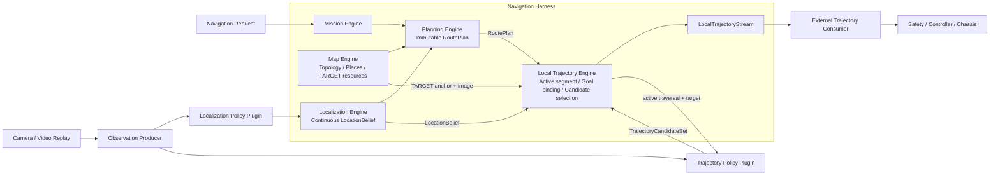

# Navigation Harness Architecture Baseline

> Status: initial version v0.4
> Runtime: Python 3.11+
> Current scope: maps, continuous localization, global routes, and
> `RoutePlan`-driven local-trajectory publication
> Explicitly excluded: collision checking, safety arbitration, trajectory
> tracking, velocity control, and chassis protocols

## 1. Summary

The Navigation Harness has five top-level engines:

1. `Mission Engine`
2. `Map Engine`
3. `Localization Engine`
4. `Planning Engine`
5. `Local Trajectory Engine`

The Local Trajectory Engine is a route-bound, stateful domain engine. Runtime
Bootstrap assembles its concrete implementation and continuous scheduling
service, connecting an established `RoutePlan`, the current location, a
Map-owned goal image, and a trajectory policy into a real-time output stream.

The Harness currently ends at:

```text
LocalTrajectoryStream
```

An external integration layer consumes complete local trajectories and connects
them to safety, trajectory tracking, control, and the robot platform. The
Harness does not interpret raw NoMaD output as velocity or steering commands.

For compatibility with Longship's existing `NavigationPort`, an integrating
runtime may additionally implement `NavigationOperationStarter`.
`start_navigation()` returns a `NavigationOperation` immediately, including
the operation's read-only `LocalTrajectoryStream`; the existing `navigate_to()`
method remains the terminal-result convenience call. This is the supported
outer-layer seam for a visualization, safety, or trajectory-tracking module to
consume live trajectories without reaching into Harness internals.

An application constructs `NavigationHarnessFactory` once with a
deployment-specific `NavigationSessionBuilder`, then passes
`factory.create_navigation_port()` to Longship Runtime. The builder is the only
place that assembles NoMaD, a ROS 2 observation source, map resources, and the
continuous Harness services for one request. It returns a `NavigationSession`;
the outer factory adapts that session to `NavigationPort` and
`NavigationOperationStarter`.

## 2. End-to-end Data Flow



The core direction is deliberately one-way:

```text
LocationBelief
+ RoutePlan
+ Map-owned target resource
+ latest observation context
→ complete LocalTrajectoryPublication
```

## 3. The Five Engines

| Engine | Responsibility | Primary output |
|---|---|---|
| Mission | Resolve targets, maintain mission lifecycle, decide when to plan or replan | `MissionStatus` |
| Map | Version places, topology, anchors, and resource references | `MapSnapshot` and query results |
| Localization | Continuously maintain robot location and reliability | `LocationBelief` |
| Planning | Compute a global sequence of directed segments | `RoutePlanningResult` / `RoutePlan` |
| Local Trajectory | Continuously resolve the active traversal and generate a short-lived local motion proposal | `LocalTrajectoryStream` |

The Local Trajectory Engine neither interprets missions nor searches for global
routes. It consumes outputs already established by the other engines and
maintains the active traversal on one immutable `RoutePlan` at runtime.

## 4. Map Engine and Goal Images

The Map Engine owns:

- nodes, segments, and directed topology;
- semantic places;
- visual `TARGET` and `LOCALIZATION` anchors;
- stable `ResourceId` values and opaque locators for goal images, metric maps,
  and other external resources;
- compatibility metadata such as image profiles, model artifact identities, and
  digests.

The Map Engine neither runs NoMaD nor stores image tensors. The Local Trajectory Engine uses
the active traversal's `target_node_id` to query the Map and requires exactly
one visual `TARGET` anchor and image resource. It then passes that bound resource
to the policy plugin.

The offline NoMaD keyframe database is therefore an external Map Engine backend,
not private state owned by a localization or policy plugin.

## 5. Localization Engine

The Localization Engine runs continuously and publishes versioned
`LocationBelief` values. The initial NoMaD implementation uses fixed-start
topological localization:

- startup localization may be established only from `node-0000`;
- each inference batch compares the current node, expected successor, and a
  bounded forward look-ahead set;
- a short evidence window drives monotonic one-node transitions instead of one
  scalar threshold sample;
- a recoverable `LOST` state searches a wider forward-only window and requires
  repeated close agreement before restoring tracking;
- by default, only a `TRACKING` belief permits an active trajectory;
- when localization is `INITIALIZING`, `LOST`, `UNAVAILABLE`, or outside the
  `RoutePlan`, the Local Trajectory Engine emits `HOLDING` and never reuses an old trajectory.

Observation production and localization ticks belong to
`LocalizationRuntime`. Raw images do not enter the public Localization Engine
facade. The implemented NoMaD profile samples observations and evaluates local
distance evidence at 9 Hz, while steady `LocationBelief` publication is
throttled to 4 Hz. State transitions publish immediately. Forward recovery is
not a global relocalization capability and does not remove the fixed-start
contract.

## 6. Planning Engine and RoutePlan

The Planning Engine is a stateless request-response service:

```python
async def plan_route(
    request: RoutePlanningRequest,
) -> RoutePlanningResult: ...
```

The initial `TopologicalPlanningEngine` performs deterministic directed
shortest-path planning on a pinned `MapSnapshot`. It handles forbidden nodes,
forbidden segments, capability constraints, preferences, and temporary
additional costs.

`RoutePlan` is an immutable global route:

```text
RoutePlan
├── route_id / request_id / snapshot_id
├── start                 # belief revision and projected topological start
├── goal                  # selected goal node
├── traversals[]          # ordered PlannedTraversal values
├── estimate
└── provenance
```

It does not contain control-rate local trajectories, velocities, steering, or
obstacle-avoidance actions. When the map, location, or constraints change, the
Mission Engine calls the planner again to produce a new `RoutePlan`; it never
modifies an existing plan in place.

## 7. Local Trajectory Engine

The Local Trajectory Engine owns fixed, auditable execution-time logic:

1. validate `RoutePlan` and `MapSnapshot` consistency at construction time;
2. pin every segment referenced by the `RoutePlan`;
3. pin the visual `TARGET` anchor and image resource for every target node;
4. read the latest `LocationBelief` on every tick;
5. resolve the active traversal monotonically and reject route-position
   regression;
6. issue a fully identified request to `VisualGoalTrajectoryPolicy`;
7. recheck the traversal after asynchronous inference and reject results from a
   previous segment;
8. select one complete candidate using an explicit selection policy;
9. publish an immutable result with an expiry and complete provenance.

The route-bound implementation is `RouteBoundLocalTrajectoryEngine`. The
initial NoMaD integration follows the official demo's candidate convention:
it always selects sample `0` but returns all eight waypoints from that sample.
The engine does not select waypoint `2`, apply scale conversion, or generate
control values.

`LocalizationDrivenLocalTrajectoryService` triggers one non-reentrant engine
tick after each new `LocationBelief`, giving localization inference priority.
If trajectory inference is slow, the service coalesces only belief revisions
that have already become obsolete. The service owns scheduling and lifecycle,
not domain decisions.

## 8. LocalTrajectoryStream

The external interface supports only reads and long polling:

```python
class LocalTrajectoryStream(Protocol):
    def get_latest(self) -> LocalTrajectoryPublication: ...

    async def wait_for_update(
        self,
        request: WaitForLocalTrajectoryRequest,
    ) -> LocalTrajectoryUpdateResult: ...
```

Publication states:

| State | Meaning |
|---|---|
| `INITIALIZING` | No route position can generate trajectories yet |
| `HOLDING` | No active trajectory may be published; treat this as no motion proposal |
| `ACTIVE` | Contains one complete, short-lived local trajectory |
| `ROUTE_COMPLETED` | Localization confirmed the `RoutePlan` goal node |
| `FAULTED` | The engine or policy encountered an unrecoverable failure |
| `STOPPED` | The service stopped and previous trajectories are invalid |

Every `ACTIVE` publication binds:

- `route_id` and `snapshot_id`;
- the belief revision;
- traversal sequence, segment, and target node;
- target anchor and goal resource;
- observation, generation, publication, and expiry times;
- candidate selection, sampling seed, policy, model, and image-profile
  identities;
- the complete waypoint sequence and its coordinate labels.

Mission and external consumers must check state, revision, and `valid_until`. They must not
reuse the previous trajectory after `HOLDING`, stop, or expiry.

## 9. Policy Plugin Boundary

`VisualGoalTrajectoryPolicy` is a plugin SPI used by the Local Trajectory
Engine, not a Skill. A Skill allows
Longship to orchestrate navigation capabilities; a policy plugin provides the
concrete NoMaD inference implementation.

The policy returns only an unselected `TrajectoryCandidateSet`. It:

- does not know about the Mission;
- does not decide which `RoutePlan` is active;
- does not interpret map semantics;
- does not select candidates or waypoints;
- does not scale output for the target robot;
- does not perform safety checks or control.

The core runtime depends only on the policy protocol and never imports NoMaD.
The NoMaD implementation lives in
`plugins/policies/visual_navigation/nomad`, while its Longship domain adapters
live in that plugin's `longship_adapter` package.

## 10. Runtime and Threading Boundaries

An observation producer samples video or camera frames at the model-context
frequency and fans them out to:

- a distance session for fixed-start localization;
- a trajectory session for local-trajectory generation.

Both contexts receive identical timestamps and image profiles. Observation
buffers are thread-safe. Distance and trajectory inference sharing one CUDA
model is serialized through a single-thread executor. Localization and
trajectory services use one monotonic clock domain, and policies reject
cross-clock or over-age observations.

The offline FFmpeg mock is an explicit exception: it uses recorded-video time as
the observation and policy clock, while wall time controls only playback pace.
This prevents CUDA or event-loop load from changing the four-frame context seen
by a localization revision. A production camera source continues to use the
runtime monotonic clock.

## 11. Current Code Structure

```text
src/longship/navigation/
├── map_engine/
├── localization_engine/
├── planning_engine/
│   └── topological.py
├── local_trajectory_engine/
│   ├── interface.py
│   ├── models.py
│   └── route_bound.py
├── mission_engine/
├── ports/
│   ├── trajectory_policy/       # plugin SPI; returns all candidates
│   └── route_execution/         # future external control/execution contract
└── runtime/
    ├── localization.py
    └── local_trajectory.py

plugins/policies/visual_navigation/nomad/
├── nomad_runtime/               # inference only
├── longship_adapter/            # Map/Localization/Trajectory SPI adapters
└── tools/                       # offline maps, video mocks, and diagnostics
```

## 12. Current Non-goals

- do not call `LocalTrajectory` a safe trajectory or control command;
- do not perform collision detection, dynamic obstacle avoidance, or geometric
  feasibility validation;
- do not perform target-robot scale calibration;
- do not generate velocity, angular velocity, curvature, or acceleration;
- do not implement a trajectory tracker, emergency stop, safety arbiter, or
  chassis interface;
- do not let policy plugins own `RoutePlan`, `LocationBelief`, or mission state;
- do not let external consumers mutate a `RoutePlan` or Harness publication.

`RouteExecutionPort` remains a possible next-stage contract for external
execution state and control lifecycle. It is not instantiated in the initial
real-time trajectory pipeline. The current runnable loop ends explicitly at
`LocalTrajectoryStream`.
