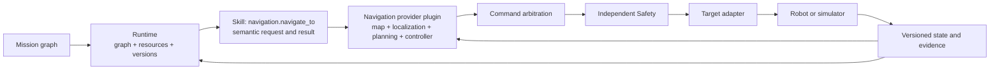

# Skills, Runtime, Navigation, and Target Boundaries

> **Status:** Draft architecture guidance. The directory layout and contract
> fields below are recommendations; they are not released compatibility
> guarantees.

## Short answer

Longship should expose capabilities through semantic Skill contracts and let a
top-level Runtime schedule them. However, a Skill cannot be only a Python
function such as `navigate_to(name)`. Physical execution also needs versioned
arguments and results, preconditions, postconditions, resource claims,
timeouts, cancellation behavior, safe points, evidence, risk, and
target-specific qualification.

The central split is:

| Component | Owns | Must not own |
| --- | --- | --- |
| Skill | A bounded semantic capability: what the robot can attempt | Global scheduling, hidden hardware commands, or Safety overrides |
| Provider or subsystem | The algorithm used to implement part of a Skill | Mission authority or an unbounded actuator path |
| Plugin | Packaging and integration for a replaceable Skill, provider, model, or SDK | Canonical Runtime state merely because it supplies an implementation |
| Runtime | Mission graph state, admission, resources, concurrency, versions, timeouts, cancellation, and recovery | Navigation, speech, manipulation, or control algorithms |
| Target adapter | Translation from approved target-independent commands and state into a particular simulator, robot, middleware, or SDK | Task planning, Skill selection, or Safety policy |
| Safety | Independent veto, limits, lease revocation, and qualified stop behavior | Ordinary mission planning |

`navigate_to` is therefore a Skill. Mapping, localization, global planning,
local planning, obstacle handling, and controller execution are navigation
provider or subsystem responsibilities. Nav2 is one possible provider plugin;
it is not the mission-level Skill contract.

## The semantic Skill boundary

A Skill describes an operator-meaningful capability that remains recognizable
when the robot, middleware, or algorithm changes. Examples include:

- `navigation.navigate_to`
- `navigation.follow_person`
- `interaction.say`
- `manipulation.pick_object`
- `manipulation.place_object`
- `service.guide_tour`

Skill names should express intent, not implementation. Names such as
`run_nav2_action`, `publish_cmd_vel`, or `call_unitree_sdk` leak provider or
target details and must not appear in a portable mission graph.

A callable interface is useful for implementation, but it is not the whole
contract. A physical Skill descriptor needs at least:

1. a stable Skill ID plus contract and implementation versions;
2. typed arguments and a typed result, with units, frames, and artifact
   revisions where applicable;
3. explicit preconditions and postconditions;
4. exclusive and shared resource claims;
5. a maximum duration and timeout outcome;
6. cancellation semantics, including a bounded cancellation deadline;
7. named safe points and the evidence required to establish them;
8. success, failure, and progress evidence with freshness and provenance;
9. a risk class, authorization and confirmation policy, and allowed operating
   envelope; and
10. qualification scope for each target, provider, configuration, and relevant
    artifact version.

For example, the conceptual contract for navigation might include:

```yaml
skill_id: navigation.navigate_to
contract_version: 1.0.0
arguments:
  map_id: string
  map_version: string
  waypoint_id: string
  arrival_tolerance_m: bounded_number
result:
  arrived: boolean
  final_pose_evidence: evidence_reference
preconditions:
  - localization_valid
  - waypoint_resolves_in_selected_map
postconditions:
  success:
    - target_pose_within_arrival_tolerance
  cancelled:
    - base_stopped_or_qualified_stop_escalated
resources:
  - name: base_motion
    access: exclusive
  - name: localization
    access: shared_read
timeout:
  maximum_duration_s: deployment_policy
cancellation:
  mode: bounded_cooperative
  required_safe_point: base_stopped
evidence:
  - route_progress
  - arrival_pose
risk:
  class: mobile_robot_motion
qualification:
  required: target_and_provider_profile
```

This descriptor does not grant authority by itself. Runtime binds an invocation
to the current mission revision, target, cancellation epoch, leases, deadline,
and qualified implementation before execution.

## What Runtime should do

Runtime is the orchestration authority. It should:

- validate the versioned mission graph and Skill calls;
- resolve a qualified implementation for the selected target;
- atomically acquire resource claims before admission;
- schedule compatible nodes in parallel and preserve graph dependencies;
- maintain the canonical task, graph, world-state, call, and cancellation
  versions;
- enforce timeouts and cancellation propagation;
- coordinate safe-point task switches and bounded recovery;
- reject stale, late, or mismatched results;
- record lifecycle events and evidence; and
- send every action-producing path through arbitration and Safety.

Runtime should not contain path-planning algorithms, speech synthesis,
manipulation policies, controller math, or vendor SDK calls. It may select and
coordinate implementations, but it must not reproduce their algorithms in the
scheduler. Likewise, Runtime cannot bypass Safety merely because it owns a
resource lease.

A Skill implementation must not start untracked child Skills to escape
Runtime's graph and resource accounting. Reusable multi-Skill behavior belongs
in a mission subgraph or an explicitly compiled composite whose child calls
remain visible to Runtime.

## Concurrency is decided by resources

Scheduling lanes are descriptive; resource leases decide whether work can
overlap.

```text
interaction.say       claims speaker: exclusive
navigation.navigate_to claims base_motion: exclusive,
                              localization: shared_read
navigation.follow_person claims base_motion: exclusive,
                                 person_tracker: shared_read
```

`say` and `navigate_to` may run together because their claims do not conflict.
This enables Jackie to explain the route while walking. Speech still remains
preemptible by a Safety alert or operator command.

`navigate_to` and `follow_person` conflict because both require exclusive
ownership of `base_motion`. Runtime must wait, reject, or perform a
safe-point handoff; it must never blend both providers' base commands. If a
future target supports a reviewed composition profile with genuinely disjoint
actuator scopes, that profile must be explicitly qualified rather than
inferred from Skill names.

## Navigation decomposition

The portable path is:



The navigation Skill accepts a semantic, bounded destination such as an
approved waypoint ID. It does not accept arbitrary shell commands, vendor
messages, or unconstrained velocity streams from a Brain.

A navigation provider implements or integrates the navigation stack. A Nav2
plugin may wrap map loading, localization, path planning, controller lifecycle,
progress, and cancellation. Another plugin may use a different stack while
satisfying the same Longship provider contract. Provider-generated motion must
still be correlated with Runtime's active lease and pass through Command
Arbitration, Safety, and the Target adapter; installing Nav2 must not create a
second path directly to hardware.

Some subsystem operations can also become semantic Skills when they are an
explicit user goal. For example, `navigation.build_map` may be a Skill, while
the SLAM engine that implements it remains a provider subsystem. This preserves
the distinction between a mission capability and its algorithm.

## Target adapters and qualification

Only a Target adapter translates approved target-independent commands into a
robot, simulator, middleware, or vendor SDK representation. It owns details
such as joint names, frame transforms, transport encoding, target command
limits, watchdog behavior, and target-side lease mapping. It does not decide
where Jackie should go.

Qualification is a binding, not a claim attached to a name. A production
deployment should identify at least:

```text
Skill contract version
+ Skill implementation version
+ provider plugin and configuration digest
+ map and model artifact digests where relevant
+ target adapter and target profile
+ Safety profile
+ evaluation evidence
```

Changing any safety-relevant element requires a new qualification decision.
Passing in simulation does not automatically qualify a physical target.

## Recommended repository layout

As the draft contracts stabilize, use the following responsibility-oriented
layout. Not every path exists yet.

```text
src/longship/
  contracts/skills/          # canonical Skill schemas and typed contracts
  runtime/                   # graph scheduler, leases, cancellation, state
  skills/                    # small provider-neutral reference implementations
  navigation/                # provider-neutral navigation protocol and mocks

plugins/
  skills/<skill-plugin>/     # optional replaceable semantic Skill implementation
  navigation/nav2/           # Nav2 integration and its manifest
  navigation/<provider>/     # another navigation implementation
  speech/asr/<provider>/     # speech-to-text provider
  speech/tts/<provider>/     # speech output provider
  targets/<target>/          # hardware/simulator translation only

scenarios/<scenario>/        # mission graphs, fixtures, and evaluation cases
```

Canonical contracts belong under `src/longship`, not inside one provider's
plugin. A plugin declares the contract versions it implements. Large maps,
bags, model weights, container images, and datasets stay in external artifact
storage by immutable digest; the repository contains manifests, adapters,
tests, and compact qualification reports.

A future provider-neutral navigation seam can evolve toward this layout without
changing the semantic meaning of `navigate_to` or exposing Nav2 and target
details to mission contracts.
