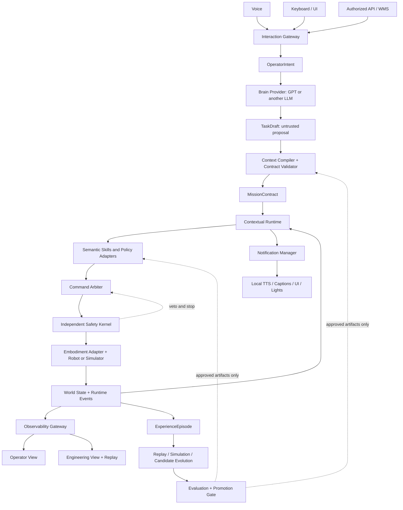
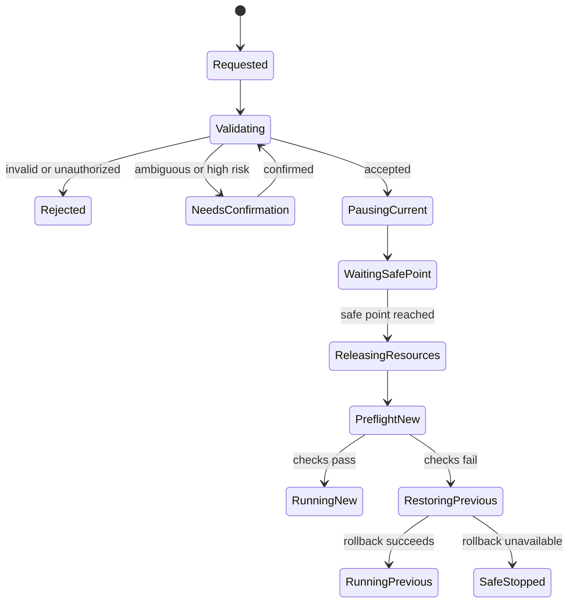
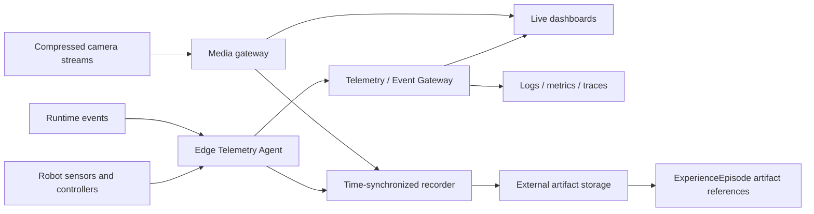

# Longship System Architecture v2

> **Status:** Draft design proposal for public review. This document is
> independently authored for Longship. It defines public responsibilities and
> interfaces; it contains no private robot implementation, internal data, model
> weights, or hardware qualification claims.

## 1. Purpose

Longship is a contracts-first physical-intelligence platform for capabilities
that can move across robot embodiments, tasks, model providers, and deployment
sites without giving up safety, explainability, or accumulated experience.

The architecture supports tasks such as material transport, spoken guidance,
table organization, object retrieval, and production-line assistance. A user
may issue a goal by voice or keyboard. The robot should explain important state
changes in ordinary language, while engineers retain access to synchronized
diagnostics, camera streams, telemetry, and replay.

The six architectural layers remain responsibility boundaries. They are not a
pipeline that every task must traverse from top to bottom on every cycle.
Longship instead operates as two connected loops with three cross-cutting
planes.

### Non-goals

- A foundation model is not a motor controller or a safety authority.
- A dashboard is not the robot's execution monitor or emergency-stop path.
- Raw video, logs, and CSV files alone are not structured experience.
- A successful simulation does not qualify a capability for real hardware.
- Candidate lessons, generated code, and trained models cannot promote or
  deploy themselves.

## 2. Architectural invariants

1. High-level AI may interpret goals, draft plans, select semantic skills,
   explain state, and propose recovery. It never publishes joint, torque,
   velocity, actuator, or vendor low-level commands.
2. Only a validated `MissionContract` is executable. Model output remains an
   untrusted `TaskDraft` until deterministic compilation and policy checks pass.
3. Runtime owns task state, resource leases, arbitration, cancellation,
   timeouts, safe-point switching, and recovery.
4. An independent local Safety Kernel can veto, slow, pause, or stop execution
   without a foundation model, dashboard, cloud service, or external network.
5. All commands are attributable, authorized, bounded, cancellable, and
   time-limited.
6. Monitoring and media failure cannot block or degrade the control loop.
7. State, decisions, telemetry, artifacts, and evaluations are correlated by
   stable IDs and versioned contracts.
8. Knowledge, models, maps, skills, configuration, and binaries are immutable
   artifacts identified by version and content hash.
9. Every capability is qualified per target; cross-embodiment portability is
   declared and tested, never assumed.
10. Production promotion always requires evidence, gates, and a rollback path.

## 3. System topology



## 4. Six responsibility layers

| Layer | Responsibility | Online role | Offline role |
| --- | --- | --- | --- |
| 1. Physical Knowledge and World Interpretation | Versioned facts, rules, provenance, maps, object and human context | Supplies scoped knowledge and a consistent world view | Accepts only reviewed knowledge updates |
| 2. Context Compilation and Scene Teaching | Turns a goal, knowledge, capabilities, and constraints into a deterministic mission | Validates `TaskDraft` and emits `MissionContract` | Builds reusable scenario packs and compiler tests |
| 3. Contextual Physical Runtime | Owns sessions, task graphs, resources, switching, timeouts, execution monitoring, and recovery | Coordinates the live mission | Produces complete event and state traces |
| 4. Skills and Policies | Implements bounded, cancellable semantic capabilities | Executes approved skill calls behind stable contracts | Trains, evaluates, and versions candidate implementations |
| 5. Simulation and Self-Evolution | Replays evidence and creates candidate rules, parameters, skills, or models | Never sits in the real-time critical path | Reproduces failures and evaluates candidates |
| 6. Execution, Evaluation, and Experience Distillation | Records outcomes, evidence, failure attribution, and qualification | Captures structured execution evidence | Compares versions and controls promotion |

`WorldStateSnapshot` is a shared contract between Layers 1, 3, 4, and 6. It is
not a mutable global object. Consumers receive timestamped, versioned snapshots
with confidence, frame, provenance, and freshness information.

## 5. Two connected loops

### 5.1 Online task loop

```text
knowledge and current context
  -> task draft
  -> deterministic mission compilation
  -> runtime and preflight
  -> bounded skill
  -> arbitration and safety
  -> robot
  -> world-state, event, and recovery feedback
```

Layers 1 and 2 run when a task is created, relevant conditions change, or the
runtime reaches a replanning boundary. The LLM is event-driven. It does not
receive every high-rate sensor sample and does not participate in motor timing.

### 5.2 Offline evolution loop

```text
ExperienceEpisode
  -> failure attribution and selection
  -> replay or simulation reproduction
  -> candidate knowledge, parameter, skill, or model
  -> regression evaluation
  -> human-reviewed promotion gate
  -> canary deployment with rollback
```

Both successful and failed executions become episodes. Success provides a
baseline; failure provides a learning target. Candidate lessons move through:

```text
candidate -> reproduced -> validated -> approved -> active -> deprecated
```

No stage may be skipped for a production target.

## 6. Three cross-cutting planes

### 6.1 Interaction and control plane

This plane accepts human or system intent, authenticates the actor, compiles
missions, leases resources, arbitrates commands, and applies safety. There is
one authoritative path to robot action.

### 6.2 Observability and experience plane

This plane collects state, events, diagnostics, media references, and model
routing metadata. It serves live views and reproducible replay. It is read-only
with respect to robot control; UI buttons submit a new `OperatorIntent` through
the Interaction Gateway.

### 6.3 Safety and governance plane

This plane enforces physical limits, authorization, privacy, artifact
provenance, evaluation gates, approvals, canaries, and rollback. It spans both
online execution and offline evolution.

## 7. Interchangeable brains, skills, and embodiments

Longship stores task state, memory, and plans in its own contracts instead of
depending on a provider's conversation state.

- A **Brain Provider** (for example GPT, Qwen, Claude, or a local model) accepts
  a normalized context and returns a strict `TaskDraft` or recovery proposal.
- A **Policy Adapter** can expose an embodied model such as GR00T or another
  VLA policy as a bounded skill backend.
- A **Locomotion or tracking adapter** can expose a framework such as Holosoma
  behind the same skill and target contracts.
- An **Embodiment Adapter** declares the target's frames, sensors, payload,
  workspace, controllers, and qualification status.
- Deterministic FSM, motion-library, PD, and classical planning skills remain
  first-class implementations, especially for service motions and recovery.

Model routing may consider modality, privacy, latency, cost, and availability.
A switch occurs only at a decision boundary. The new provider receives the
canonical `TaskState`; it cannot inherit hidden authority from the previous
provider. Provider name, model identifier, adapter version, latency, and
decision ID are recorded by the gateway rather than trusted from model output.

### 7.1 Decision continuity and anti-flapping

Runtime, not the model provider, constructs a `BrainRequest` from canonical
state. It includes the task and plan version, current `ExecutionSnapshot`,
previous accepted decision, active Skill call, safe point, resource leases,
qualified Skill descriptors, recent material events, and a small set of
relevant historical episode summaries.

Context is layered:

1. authoritative task, execution, and world-state facts are always present;
2. the active Skill, resources, and previous accepted decision are always
   present;
3. recent history is a bounded event window; and
4. older experience is retrieved by relevance as summaries and immutable
   references.

Raw chat history, full logs, video bytes, and high-rate joint streams are not
used as state. When history conflicts with the current snapshot, the current
versioned snapshot wins.

A Brain request is created only for a deduplicated material trigger: new goal,
terminal Skill result, declared safe point, significant world change, operator
interrupt, exhausted recovery budget, safety follow-up, invalid plan, or
deadline. Progress and telemetry events do not invoke the Brain by default.

`BrainDecision` is a proposal with compare-and-swap conditions. Before
acceptance, Runtime atomically verifies:

```text
trigger ID and dedupe key
+ request decision idempotency key
+ execution snapshot ID
+ state version
+ plan version
+ expected previous decision ID
+ expected active Skill call ID
+ expected safe-point ID
+ decision expiry
```

A mismatch rejects the proposal without side effects. The default while a
valid Skill is active is `continue_active_skill` or `wait_for_event`. A new
Skill, cancellation, or plan replacement requires an allowed material trigger
and, where required, a declared safe point. Plan patches may modify pending
steps only; they cannot rewrite running or terminal steps.

The provider gateway assigns or verifies IDs and timestamps. Runtime issues
resource leases and accepted Skill call IDs. Model-generated Skill arguments
are validated again against the selected semantic Skill input schema. Generic
shell, SDK, joint, torque, motor, or trajectory tools are never exposed to the
Brain.

Debounce, minimum hold time, bounded retry and replan budgets, and per-trigger
idempotency further reduce oscillation. These stability rules never delay the
independent Safety Kernel.

Draft contracts:

- `ExecutionSnapshot` is the authoritative execution fact source;
- `BrainRequest` is bounded, event-driven context; and
- `BrainDecision` is a version-bound high-level proposal.

### 7.2 Large model and framework integration

Longship keeps adapters and manifests in Git while weights, checkpoints,
datasets, and runtime images remain in external registries. Deployment resolves
immutable hashes into a local cache before a mission and never downloads a
model while the robot is moving.

GR00T and UnifoLM are treated as optional VLA policy providers. Holosoma is
treated as a training/deployment framework whose exported checkpoints are
versioned separately. Unitree is treated as a target SDK and embodiment
adapter; using a Unitree policy requires an additional policy manifest and
qualification.

See [Model, Framework, and Artifact Integration](model-and-artifact-integration.md)
for repository layout, artifact resolution, license gates, caching, inference
boundaries, CI, observability, and target-scoped promotion.

## 8. Voice and keyboard interaction

### 8.1 One semantic ingress

```text
voice: VAD -> ASR -> intent normalization
keyboard: command palette -> intent normalization
API/WMS: authenticated request -> intent normalization
                         |
                         v
                    OperatorIntent
                         |
                         v
          authorization + TTL + confirmation policy
```

An ASR transcript or free-form text is untrusted input. It may express a goal,
but it is never an executable command. `OperatorIntent` records source, actor,
authorization scope, confidence, expiry, language, robot context, and
correlation IDs.

Initial task-level intents should be intentionally small:

- submit a goal;
- pause, resume, or cancel a task;
- request robot or task status; and
- answer a confirmation challenge.

Ambiguous, low-confidence, high-risk, or target-changing intent requires
confirmation. The robot should restate the proposed action and relevant
constraint, not merely ask "Are you sure?".

### 8.2 Emergency stop and manual teleoperation

Emergency stop is not a voice intent and does not pass through an LLM. It uses
a physical or deterministic local safety path.

Manual keyboard teleoperation is a separate bounded mode. It must require an
authorized operator, an explicit mode transition, exclusive resource lease,
dead-man input, short command TTL, low initial speed limits, and automatic stop
on key release, focus loss, stale input, or network loss. It may bypass the
Brain Provider, but never arbitration or Safety.

## 9. Transactional task switching

A new task does not replace a running task immediately. Runtime performs a
transactional switch at an explicit skill safe point.



A safe point is declared by the skill contract. Examples include stopped base
motion, supported payload, no active contact transition, and bounded actuator
state. Runtime never switches in the middle of an indivisible motion or contact
action.

## 10. Human-readable announcements

The Notification Manager subscribes to authoritative `RuntimeEvent` messages.
It never announces model predictions as completed physical actions.

| Runtime event | Example user-facing meaning | Default behavior |
| --- | --- | --- |
| `task.accepted` | "I received the box-delivery task." | Brief confirmation |
| `task.switch.waiting_safe_point` | "I will safely finish this motion before switching tasks." | Speak once, show progress |
| `task.started` | "I am starting the delivery." | Speak and caption |
| `task.paused` | "I paused because the path is blocked." | Speak reason and next step |
| `recovery.started` | "The grasp was not stable. I am aligning again." | Rate-limited explanation |
| `operator.help_required` | "I need help clearing the destination." | Persistent alert |
| `task.completed` | "The box has been placed at the destination." | Only after success evidence |
| `safety.protective_stop` | "I stopped for safety. Please keep the area clear." | High-priority local template |

Safety and task-transition messages use deterministic, localized templates.
An LLM may optionally paraphrase noncritical explanations, but it cannot remove
required facts, lower severity, or delay delivery. Voice, captions, UI, lights,
and remote notifications share one event source.

Notification policy includes priority, deduplication, cooldown, interruption,
quiet mode, localization, and accessibility. Critical local alerts preempt
noncritical speech. TTS failure falls back to captions and visible status;
failure of all notification outputs does not change Safety behavior.

## 11. Runtime observability

### 11.1 Protection and visualization are separate

- `ExecutionMonitor` is inside Runtime and may trigger recovery, slowdown,
  pause, or safe stop.
- `TelemetryAgent` timestamps, normalizes, validates, buffers, and downsamples
  data at the edge.
- `ObservabilityGateway` serves live data, history, alerts, and stream metadata.
- Dashboards explain state; they are not trusted control components.



Camera and other high-bandwidth media use a separate transport from structured
telemetry. The episode stores stable URI, hash, media type, capture window,
provenance, and privacy classification—not embedded video bytes.

### 11.2 Identity, time, and validity

Every telemetry envelope carries:

- robot and source component identity;
- sequence number;
- monotonic acquisition time and wall-clock time;
- unit and coordinate frame when applicable;
- validity, quality, age, stale threshold, and drop count;
- schema and payload type;
- mission, session, task, skill, and trace correlation when present; and
- privacy classification.

Components must reject or visibly mark stale, invalid, frame-unknown,
unit-unknown, or clock-unsynchronized data. Spoken status uses the same validity
rules; the robot says that a value is unavailable instead of inventing it.

### 11.3 Two audience-specific views

**Operator view**

- current task, current skill, progress, and next expected action;
- plain-language state and the latest relevant announcement;
- primary camera, map or destination, payload state, and nearby-human state;
- battery, thermal, network, sensor, and safety summaries;
- a large pause action and a clearly distinct safe-stop action; and
- only alerts that require attention.

**Engineering view**

- full-body pose, transform tree, IMU, localization, and covariance;
- joint position, velocity, effort, current, temperature, and limit margin;
- controller mode, command owner, lease, TTL, and saturation;
- camera and sensor timestamps, frame drops, and calibration version;
- battery, thermal, compute, storage, and process health;
- network latency, loss, reconnects, and middleware health;
- brain provider, model and adapter version, inference latency, retries, and
  validation outcome; and
- synchronized event timeline, logs, traces, media, and version comparison.

Browser clients never publish directly to robot middleware. Any operator action
returns through the authenticated Interaction Gateway.

### 11.4 Suggested starting rates

These are initial display and orchestration budgets, not controller guarantees.
Each target declares and tests its own rates.

| Data or loop | Suggested starting budget |
| --- | --- |
| Foundation-model reasoning | Event-driven only |
| Runtime orchestration | 10-20 Hz plus events |
| Skill feedback | 20-100 Hz |
| Target controller | 200-1000 Hz, target-specific |
| Independent safety checks | Target-specific high-rate path |
| Joint and body-pose dashboard | 10-30 Hz |
| Temperature, battery, compute | 1-5 Hz |
| Communication health | 1-2 Hz plus events |
| Compressed camera preview | 10-30 frames/s, bandwidth-adaptive |

High-rate local capture may be faster than dashboard rendering. Backpressure,
video decode, browser load, recording, or remote-network loss must never block
Runtime, controllers, or Safety.

## 12. Experience and promotion

`ExperienceEpisode` is a reproducible index over what happened, why it was
judged successful or failed, and where immutable evidence lives. It includes:

- mission, context, and world-state references;
- knowledge, map, code, configuration, runtime, model, adapter, and skill
  versions;
- ordered skill calls, results, retries, recovery, and safety events;
- outcome and explicit success evidence;
- failure taxonomy, observed facts, root-cause hypothesis, and confidence;
- synchronized artifact references for telemetry, media, logs, and traces;
- evaluation results and target qualification scope; and
- candidate lessons with evidence and stated applicability.

Large artifacts live outside Git and outside the episode payload. Sensitive
recordings require access controls, retention policy, and redaction where
appropriate. A hash verifies content; a URI locates it.

Promotion follows replay, simulation where relevant, regression, human review,
canary deployment, monitoring, and rollback. An episode may propose a lesson;
it cannot mark that lesson active.

## 13. Initial contract map

| Contract | Authority and purpose |
| --- | --- |
| `OperatorIntent` | Normalized, attributable human or system intent; never low-level control |
| `ExecutionSnapshot` | Authoritative active Skill, safe point, leases, versions, and safety state |
| `BrainRequest` | Bounded event-triggered context, current skills, and relevant history |
| `BrainDecision` | Version-bound, expiring high-level proposal with incremental plan patch |
| `TaskDraft` | Untrusted brain proposal |
| `MissionContract` | Validated executable task and constraints |
| `SkillContract` | Bounded capability, safe points, cancellation, evidence, and risk |
| `WorldStateSnapshot` | Timestamped and versioned state used for decisions |
| `RuntimeEvent` | Authoritative lifecycle, safety, recovery, and health transition |
| `TelemetryEnvelope` | Multi-rate observation metadata and typed payload reference |
| `CommandEnvelope` | Bounded command with owner, TTL, target, and arbitration state |
| `ExperienceEpisode` | Structured execution evidence and artifact index |
| `EvaluationResult` | Reproducible metrics and promotion decision |
| `ArtifactManifest` | Hash, provenance, license, compatibility, and storage URI |
| `ModelArtifactManifest` | External weights, runtime, resources, licenses, interfaces, and safety envelope |

The first draft schemas in `schemas/proposals/` are discussion artifacts, not
released compatibility guarantees.

## 14. Degraded modes and failure behavior

| Failure | Required behavior |
| --- | --- |
| ASR unavailable or low confidence | Do not act; use keyboard or ask for confirmation |
| Brain timeout, invalid output, or unavailable provider | Produce no command; bounded retry or provider fallback at a decision boundary |
| Unknown skill or invalid arguments | Validator rejects; replan once or ask the operator |
| Stale world state | Discard decision, refresh state, and recompile or pause |
| TTS unavailable | Continue safely; use captions, UI, and visible indicators |
| Dashboard unavailable | Local runtime and safety continue; retain bounded edge buffer |
| Network loss during teleoperation | Expire command lease and stop locally |
| Camera unavailable | Mark invalid; pause tasks whose evidence or safety contract requires vision |
| Telemetry overload | Preserve safety and control, shed display detail, keep critical events |
| Storage unavailable | Continue only within declared local buffer and task policy; never block control |
| Safety event | Preempt skills immediately and enter target-defined safe state |
| No progress or repeated recovery | Exhaust bounded budget, safe-stop, and explain the blocker |

## 15. Rollout plan and acceptance metrics

### Phase A: contracts and mock target

- Validate the eight draft schemas and representative examples.
- Normalize keyboard input into `OperatorIntent`.
- Execute task lifecycle and switching on a mock target.
- Generate deterministic announcements from `RuntimeEvent`.
- Render synthetic joint, pose, thermal, camera-metadata, and communication
  telemetry.
- Exercise decision deduplication, compare-and-swap rejection, sticky active
  Skills, and a mock artifact resolver without downloading model weights.

### Phase B: local voice and engineering replay

- Add VAD, ASR, deterministic confirmation, and local TTS adapters.
- Add a read-only operator view and engineering view.
- Record time-synchronized telemetry and media artifact references.
- Replay a complete success, safe-stop, and task-switch episode.

### Phase C: one protected robot target

- Add target-specific limits, manual supervision, physical emergency stop,
  privacy review, and qualification gates.
- Measure intent-to-acknowledgement latency, announcement correctness, stale-data
  detection, switch-to-safe-point time, telemetry loss, recovery success, and
  safe-stop latency.
- Run canary deployments with explicit rollback.

An initial vertical slice should use a small semantic skill set—such as `say`,
`safe_stop`, `navigate`, `follow`, `pick`, `place`, and `report_status`—before
adding more model providers or embodiments.

## 16. Non-normative open-source implementation candidates

Heavy model and target integrations are governed by the separate
[model and artifact integration proposal](model-and-artifact-integration.md).
The following tools remain optional observability and storage candidates:

Longship contracts should not depend on these projects, but adapters may use:

- [ROS 2 diagnostic messages](https://docs.ros.org/en/ros2_packages/humble/api/diagnostic_msgs/) for component health;
- [OpenTelemetry](https://opentelemetry.io/docs/) for application logs, metrics, and traces;
- [Foxglove](https://docs.foxglove.dev/docs/visualization/panels/3d) for engineering visualization and replay; and
- [MCAP](https://mcap.dev/) for time-synchronized robotics recordings.

Selections remain target- and deployment-specific. Stable Longship contracts
must outlive any individual middleware, viewer, storage format, or model.

---

**Longship principle:** let models understand and propose; let contracts define;
let Runtime coordinate; let Skills act; let Safety veto; let monitoring explain
the present; and let experience improve the next version.
