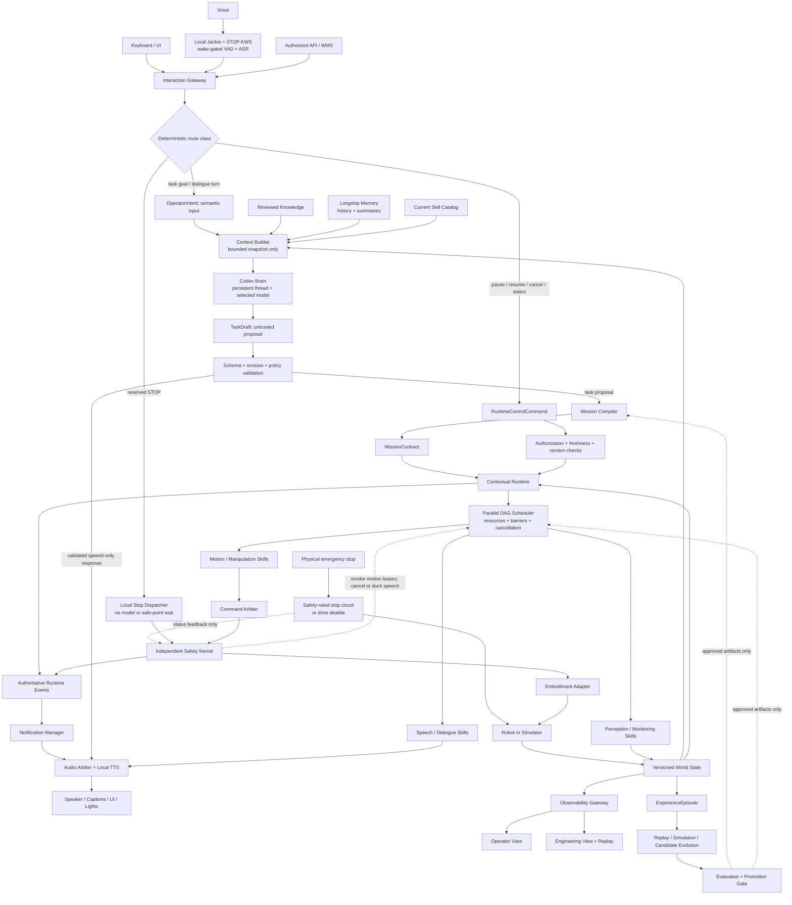
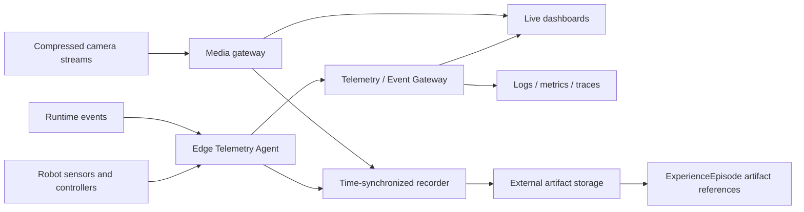

# Longship System Architecture v2

> **Status:** Draft design proposal for public review. This document is
> independently authored for Longship. It defines public responsibilities and
> interfaces; it contains no private robot implementation, internal data, model
> weights, or hardware qualification claims.

## 1. Purpose

Longship is a contracts-first physical-intelligence platform for capabilities
that can move across robot embodiments, tasks, model providers, and deployment
sites without giving up safety, explainability, or accumulated experience.

The architecture supports tasks such as material transport, spoken guidance,
table organization, object retrieval, and production-line assistance. A user
may issue a goal by voice or keyboard. The robot should explain important state
changes in ordinary language, while engineers retain access to synchronized
diagnostics, camera streams, telemetry, and replay.

The six architectural layers remain responsibility boundaries. They are not a
pipeline that every task must traverse from top to bottom on every cycle.
Longship instead operates as two connected loops with three cross-cutting
planes.

### Non-goals

- A foundation model is not a motor controller or a safety authority.
- A dashboard is not the robot's execution monitor or emergency-stop path.
- Raw video, logs, and CSV files alone are not structured experience.
- A successful simulation does not qualify a capability for real hardware.
- Candidate lessons, generated code, and trained models cannot promote or
  deploy themselves.

## 2. Architectural invariants

1. High-level AI may interpret goals, draft plans, select semantic skills,
   explain state, and propose recovery. It never publishes joint, torque,
   velocity, actuator, or vendor low-level commands.
2. Only a validated `MissionContract` is executable. Model output remains an
   untrusted `TaskDraft` until deterministic compilation and policy checks pass.
3. Runtime owns task state, resource leases, arbitration, cancellation,
   timeouts, safe-point switching, and recovery.
4. An independent local Safety Kernel can veto, slow, pause, or stop execution
   without a foundation model, dashboard, cloud service, or external network.
5. All commands are attributable, authorized, bounded, cancellable, and
   time-limited.
6. Monitoring and media failure cannot block or degrade the control loop.
7. State, decisions, telemetry, artifacts, and evaluations are correlated by
   stable IDs and versioned contracts.
8. Knowledge, models, maps, skills, configuration, and binaries are immutable
   artifacts identified by version and content hash.
9. Every capability is qualified per target; cross-embodiment portability is
   declared and tested, never assumed.
10. Production promotion always requires evidence, gates, and a rollback path.
11. Fixed keyboard bindings and reserved voice controls are classified before any model call.
12. A protective stop is idempotent and never waits for a Brain, compiler, scheduler, resource lease, Skill safe point, TTS, dashboard, or cloud service.
13. Parallel work is admitted only when resource claims are compatible; scheduling lanes never grant actuator authority.
14. Models are selected per role, not globally. A shadow model owns no actuator lease, and only one active session may own a given actuator scope.
15. Cancellation is hierarchical, bounded, monotonic, versioned, and unable to resurrect work through late results.
16. A stop acknowledgement proves only receipt. "Stopped" requires measured target-specific motion or safe-state evidence.
17. Codex is the reference high-level Brain, while Longship owns canonical memory, context assembly, voice transport, validation, and execution state.

## 3. System topology



## 4. Six responsibility layers

| Layer | Responsibility | Online role | Offline role |
| --- | --- | --- | --- |
| 1. Physical Knowledge and World Interpretation | Versioned facts, rules, provenance, maps, object and human context | Supplies scoped knowledge and a consistent world view | Accepts only reviewed knowledge updates |
| 2. Context Compilation and Scene Teaching | Turns a goal, knowledge, capabilities, and constraints into a deterministic mission | Validates `TaskDraft` and emits `MissionContract` | Builds reusable scenario packs and compiler tests |
| 3. Contextual Physical Runtime | Owns sessions, task graphs, resources, switching, timeouts, execution monitoring, and recovery | Coordinates the live mission | Produces complete event and state traces |
| 4. Skills and Policies | Implements bounded, cancellable semantic capabilities | Executes approved skill calls behind stable contracts | Trains, evaluates, and versions candidate implementations |
| 5. Simulation and Self-Evolution | Replays evidence and creates candidate rules, parameters, skills, or models | Never sits in the real-time critical path | Reproduces failures and evaluates candidates |
| 6. Execution, Evaluation, and Experience Distillation | Records outcomes, evidence, failure attribution, and qualification | Captures structured execution evidence | Compares versions and controls promotion |

`WorldStateSnapshot` is a shared contract between Layers 1, 3, 4, and 6. It is
not a mutable global object. Consumers receive timestamped, versioned snapshots
with confidence, frame, provenance, and freshness information.

The concrete separation between a semantic Skill, its provider, Runtime,
Safety, and a target adapter is specified in
[Skills, Runtime, Navigation, and Target Boundaries](skills-and-runtime.md).

## 5. Two connected loops

### 5.1 Online task loop

```text
knowledge and current context
  -> task draft
  -> deterministic mission compilation
  -> runtime and preflight
  -> bounded skill
  -> arbitration and safety
  -> robot
  -> world-state, event, and recovery feedback
```

Layers 1 and 2 run when a task is created, relevant conditions change, or the
runtime reaches a replanning boundary. The Codex Brain is event-driven. It does
not receive every high-rate sensor sample and does not participate in motor
timing.

### 5.2 Offline evolution loop

```text
ExperienceEpisode
  -> failure attribution and selection
  -> replay or simulation reproduction
  -> candidate knowledge, parameter, skill, or model
  -> regression evaluation
  -> human-reviewed promotion gate
  -> canary deployment with rollback
```

Both successful and failed executions become episodes. Success provides a
baseline; failure provides a learning target. Candidate lessons move through:

```text
candidate -> reproduced -> validated -> approved -> active -> deprecated
```

No stage may be skipped for a production target.

## 6. Three cross-cutting planes

### 6.1 Interaction and control plane

This plane has one authenticated ingress and multiple deterministic routes. A
semantic task goal may reach a Brain Provider. A fixed runtime control goes
straight to Runtime. A reserved protective-stop request goes to the local Safety
path. Physical emergency-stop hardware remains independent of application
software.

All actuator-producing paths still converge at Command Arbitration and Safety.
The fast path changes latency and authority boundaries; it does not create an
unbounded route from a keyboard, browser, speech recognizer, or model to a
motor.

### 6.2 Observability and experience plane

This plane collects state, events, diagnostics, media references, and model
routing metadata. It serves live views and reproducible replay and has no direct
actuator authority. UI controls return through the Interaction Gateway, but
their contract depends on intent: semantic input emits `OperatorIntent`;
pause, resume, cancel, status, speed, confirmation, and mode controls emit
`RuntimeControlCommand`; protective stop emits `SafetyStopRequest`.

### 6.3 Safety and governance plane

This plane enforces physical limits, authorization, privacy, artifact
provenance, evaluation gates, approvals, canaries, and rollback. It spans both
online execution and offline evolution.

## 7. Interchangeable brains, skills, and embodiments

Longship stores task state, memory, and plans in its own contracts instead of
depending on a provider's conversation state. The public reference Brain is
Codex, controlled through its local SDK/app-server interface. The provider
contract remains explicit so the selected underlying model can change without
changing Runtime or granting new authority.

- The **Codex Brain Provider** accepts a bounded normalized context and returns
  a strict `TaskDraft`, dialogue response, or recovery proposal.
- A **Policy Adapter** can expose an embodied model such as GR00T or another
  VLA policy as a bounded skill backend.
- A **Locomotion or tracking adapter** can expose a framework such as Holosoma
  behind the same skill and target contracts.
- An **Embodiment Adapter** declares the target's frames, sensors, payload,
  workspace, controllers, and qualification status.
- Deterministic FSM, motion-library, PD, and classical planning skills remain
  first-class implementations, especially for service motions and recovery.

Model routing may consider modality, privacy, latency, cost, and availability.
A switch occurs only at a decision boundary. The new provider receives the
canonical `TaskState`; it cannot inherit hidden authority from the previous
provider. Provider name, model identifier, adapter version, latency, and
decision ID are recorded by the gateway rather than trusted from model output.

Codex is an agent layer over an explicitly selected model. Its context window
is therefore model- and account-dependent; it is not a fixed property of the
Longship contract and it is not durable robot memory. Even when a selected
model supports roughly one million tokens, Runtime sends a small authoritative
snapshot plus retrieved summaries instead of replaying raw history, logs, or
telemetry. ChatGPT Voice in the desktop app is also distinct from the Codex
SDK. A robot deployment keeps VAD/ASR, reserved command recognition, Audio
Arbitration, and TTS in separate providers so speech latency or failure cannot
block deterministic control.

### 7.1 Role-scoped concurrent model sessions

Longship does not have one global "current model." The Model Session Manager
resolves an immutable `ModelSessionLock` audit snapshot with at most one
active binding per role:

| Role | Responsibility | Normal handoff boundary |
| --- | --- | --- |
| `brain` | Planning, replanning, and recovery proposals | Completed decision |
| `dialogue` | Open-ended conversation | Utterance |
| `asr` | Streaming speech recognition | Audio segment |
| `tts` | Speech generation | Utterance |
| `perception` | Detection, tracking, and scene interpretation | Frame |
| `vla_policy` | Bounded manipulation proposals or action chunks | Action chunk plus safe hold |
| `locomotion_policy` | Base, leg, and waist movement | Qualified support phase or stable stand |
| `whole_body_tracking` | Bounded whole-body reference generation | Declared stable hold |
| `world_model` | Prediction, scoring, and offline rollout | Rollout |

Non-actuating roles may run concurrently. Action-producing roles may coexist
only when their Runtime-issued actuator leases are disjoint and a target-tested
composition profile exists. A VLA requesting whole-body authority must wait for
locomotion to reach a qualified safe point and release conflicting resources.

The Model Session Manager resolves locks, starts and warms sessions, performs
shadow comparisons, monitors health, and requests transactional handoff. It
cannot approve an action or grant itself a resource lease. Every action-bearing
result is correlated with the lock, session, observation, lease, sequence,
deadline, and expiry.

Each role binding has an independent immutable identity, revision, digest,
deployment lock, handoff-gate profile, predecessor, and rollback target. The
aggregate lock is an audit snapshot: changing TTS does not make an unchanged
locomotion binding stale.

A model change follows the binding's immutable pass/fail gates:

```text
resolve -> verify -> warm gate -> shadow gate -> wait for role safe point
        -> drain old session -> atomic role-binding and lease handoff
        -> canary gate -> commit binding or deterministic role rollback
```

Candidate output is discarded during warm and shadow phases. Action roles
require nonzero warm, shadow, and canary gates. The previous qualified binding
remains authoritative and rollback-ready until canary succeeds. Canonical
Longship state is transferred across providers; opaque vendor session state
never becomes the robot's source of truth.

### 7.2 Decision continuity and anti-flapping

Runtime, not the model provider, constructs a `BrainRequest` from canonical
state. It includes the task and plan version, current `ExecutionSnapshot`,
previous accepted decision, active Skill set and foreground call, graph safe point, resource leases,
qualified Skill descriptors, recent material events, and a small set of
relevant historical episode summaries.

Context is layered:

1. authoritative task, execution, and world-state facts are always present;
2. the active Skill set, foreground call, resources, cancellation epoch, and
   previous accepted decision are always present;
3. recent history is a bounded event window; and
4. older experience is retrieved by relevance as summaries and immutable
   references.

Raw chat history, full logs, video bytes, and high-rate joint streams are not
used as state. When history conflicts with the current snapshot, the current
versioned snapshot wins.

A Brain request is created only for a deduplicated material trigger: new goal,
terminal graph-node result, declared safe point, significant world change, operator
interrupt, exhausted recovery budget, safety follow-up, invalid plan, or
deadline. Progress and telemetry events do not invoke the Brain by default.

`BrainDecision` is a proposal with compare-and-swap conditions. Before
acceptance, Runtime atomically verifies:

```text
trigger ID and dedupe key
+ request decision idempotency key
+ execution snapshot ID
+ state version
+ plan version
+ expected previous decision ID
+ expected foreground Skill call ID
+ expected active Skill set version
+ expected safe-point ID
+ decision expiry
```

A mismatch rejects the proposal without side effects. Brain decisions remain
serial even when Skills execute in parallel. The default while valid work is
active is `continue_active_skill` for the foreground call or
`wait_for_event`; auxiliary calls continue under the graph. A new Skill,
cancellation, or graph replacement requires an allowed material trigger and,
where required, a declared safe point. `MissionTaskGraphPatch` makes each
proposed node, edge, barrier, or admission-group change explicit and binds it to `base_graph_version`, the current Runtime state
version, and the active-Skill-set version. Patches may modify pending nodes only;
they cannot rewrite running or terminal nodes.

The provider gateway assigns or verifies IDs and timestamps. Runtime issues
resource leases, graph-node admissions, cancellation epochs, and accepted Skill
call IDs. Model-generated Skill arguments
are validated again against the selected semantic Skill input schema. Generic
shell, SDK, joint, torque, motor, or trajectory tools are never exposed to the
Brain.

Debounce, minimum hold time, bounded retry and replan budgets, and per-trigger
idempotency further reduce oscillation. These stability rules never delay the
independent Safety Kernel.

Draft contracts:

- `ExecutionSnapshot` is the authoritative graph and active-Skill-set fact source;
- `BrainRequest` is bounded, event-driven context; and
- `BrainDecision` is a version-bound high-level proposal; and
- `MissionTaskGraphPatch` is a typed, expiring, pending-only graph update with
  compare-and-swap preconditions.

### 7.3 Large model and framework integration

Longship keeps adapters and manifests in Git while weights, checkpoints,
datasets, and runtime images remain in external registries. Deployment resolves
immutable hashes into a local cache before a mission and never downloads a
model while the robot is moving.

GR00T and UnifoLM are treated as optional VLA policy providers. Holosoma is
treated as a training/deployment framework whose exported checkpoints are
versioned separately. Unitree is treated as a target SDK and embodiment
adapter; using a Unitree policy requires an additional policy manifest and
qualification.

See [Model, Framework, and Artifact Integration](model-and-artifact-integration.md)
for repository layout, artifact resolution, license gates, caching, inference
boundaries, CI, observability, and target-scoped promotion.

## 8. Deterministic interaction and parallel task execution

### 8.1 One ingress, four routes

| Route | Examples | Brain used? | Safe-point wait? |
| --- | --- | --- | --- |
| Semantic task or dialogue | "Take this box to reception"; open-ended question | Usually | Normal mission or dialogue rules |
| Runtime control | Pause, resume, cancel, status, speed limit, confirmation answer | No | Command-specific |
| Protective stop | Reserved `STOP` binding or qualified local keyword | No | Never |
| Physical emergency stop | Safety-rated hardware input | No software dependency | Never |

The Interaction Gateway authenticates the source and classifies reserved
commands before free-form input reaches any model. Keyboard control uses fixed
bindings or a command palette. A reserved voice stop uses a small local grammar
or qualified keyword detector; an ASR transcript is never executable by itself.
A voice stop is an operational protective stop, not a safety-rated physical
emergency stop.

`OperatorIntent` carries semantic task or dialogue input.
`RuntimeControlCommand` carries deterministic pause, resume, cancel, status,
confirmation, speed-scale, and teleoperation-mode operations.
`SafetyStopRequest` carries an idempotent protective-stop request. Physical
emergency-stop input remains outside these application contracts.

### 8.2 Stop, acknowledgement, and manual control

After a stop is recognized at the robot-side gateway, dispatch bypasses the
Brain, task compiler, DAG scheduler, ordinary resource queues, Skill safe
points, TTS, observability, and cloud services. A remote stop request still
incurs transport latency before robot-side recognition; that latency is measured
separately. Local protective stop and physical emergency-stop paths do not
depend on an external network. Safety selects the target-qualified stop
profile, revokes motion
leases, issues the stop, and measures the outcome. Software cannot clear a
physical emergency stop or a latched protective stop merely by receiving
`resume`.

Stop timing uses distinct monotonic timestamps:

```text
t0 = reserved command recognized
t1 = Safety Kernel receives the request
t2 = target stop command is issued
t3 = measured motion falls below the qualified threshold
t4 = target-defined safe state is verified

dispatch latency = t1 - t0
command latency  = t2 - t1
braking latency  = t3 - t2
safe-state time  = t4 - t0
```

These differences are valid only after all timestamps are expressed in one
declared monotonic clock domain, or in synchronized domains with a recorded
worst-case clock-error bound. `ControlCommandResult` records the clock domain,
relation, error bound, and the Safety-resolved stop profile. Only a qualified
Safety Kernel or target monitor may verify measured motion cessation or a safe
state, and those result phases use the local Safety path. Unsynchronized
timestamps remain useful as ordered local evidence but cannot support
cross-process latency subtraction.

`accepted` means only that the request was received. The robot may immediately
display or say "Stopping." It may say "Stopped" after `t3` only when the
resolved target stop profile defines motion cessation as sufficient; profiles
that require a verified safe state must wait for `t4`. Missing a
target-specific deadline emits `safety.stop_timeout` and triggers the
qualified escalation path. Target qualification records worst-case dispatch,
command, braking, stopping-distance, and safe-state bounds rather than relying
on one universal latency claim.

Manual keyboard teleoperation is a separate bounded mode. It requires an
authorized operator, explicit mode transition, exclusive command ownership,
dead-man input, short TTL, conservative limits, and automatic stop on key
release, focus loss, stale input, or network loss. It bypasses the Brain but
never arbitration or Safety. The public Brain Skill registry never exposes
joint, torque, motor, PWM, vendor SDK, shell, or raw trajectory controls.

### 8.3 Parallel mission DAG

A mission is a directed acyclic graph, not a single sequential Skill list.
Ready nodes may run concurrently when all dependency conditions pass and their
resource claims can be acquired atomically. Lanes such as `motion`, `speech`,
`perception`, and `monitoring` are scheduling labels; actual concurrency is
decided by leases.

For example:

```text
carry_box    claims base + arms
say_progress claims speaker
watch_people claims camera read + perception capacity

carry_box and say_progress may overlap
watch_people may overlap both
two writers for base or the same arm may not overlap
```

An edge may release a dependent node after admission, start, success, failure,
cancellation, or any terminal outcome. `all_or_none` admission groups
atomically acquire the union of member resource claims before any member starts; `best_effort` groups admit compatible members
deterministically. Admission groups coordinate nodes that should start
together. Barrier nodes declare `all_succeeded`,
`all_terminal`, `any_succeeded`, or a quorum, plus a deadline and timeout
behavior. A speech node blocks mission completion only when
`required_for_completion=true`.

| Operation | Deterministic behavior |
| --- | --- |
| Pause | Stop admitting new work; actuator Skills quiesce at declared safe points. |
| Cancel | Apply one hierarchical, idempotent cancellation epoch; block new children and cancel the selected scope. |
| Task switch | Compile the new mission, reach ordinary safe points, release resources atomically, then commit or roll back. |
| Protective stop | Bypass graph and safe points; Safety revokes motion leases and applies the qualified stop profile. |
| Physical emergency stop | Use the independent hardware/Safety path; application software cannot clear it. |

Cancellation tokens propagate mission to parallel group to graph node to Skill.
Terminal state is monotonic. A late result from an older cancellation epoch is
recorded for evidence but cannot restart work, release a current barrier, or
satisfy a current success condition. Resource acquisition uses a stable order,
deadlock detection, deterministic tie-breaking, and priority inheritance where
supported.

### 8.4 Speech while acting

Mission speech normally owns only the speaker and can run while navigation,
carrying, manipulation, perception, and monitoring continue. A synchronized
gesture must additionally claim the required joints and pass the same
composition checks as any other motion.

Speech priorities are:

```text
safety alert
> operator confirmation
> task transition
> ordinary mission speech
> open-ended dialogue
```

Higher-priority messages may duck or cancel lower-priority TTS. Validated echo
cancellation, push-to-talk, or barge-in keeps reserved stop detection available
while the robot speaks. Barge-in cancels speech; it changes robot motion only
when the deterministic control or safety route accepts the resulting command.
TTS completion is never allowed to block a control loop, and an announcement is
never evidence that a physical transition completed.

## 9. Transactional task and graph switching

A new task or graph revision does not replace running work immediately. Runtime
first freezes admission of affected pending nodes and creates one versioned,
aggregate switch barrier containing:

- the expected graph and active-Skill-set versions;
- every affected call ID and resource owner;
- one cancellation epoch;
- the required safe-point code for each actuator Skill;
- a barrier deadline; and
- the qualified timeout fallback.

```mermaid
stateDiagram-v2
    [*] --> Requested
    Requested --> Validating
    Validating --> Rejected: invalid or unauthorized
    Validating --> NeedsConfirmation: ambiguous or high risk
    NeedsConfirmation --> Validating: confirmed
    Validating --> FreezingAdmission: accepted
    FreezingAdmission --> WaitingSwitchBarrier
    WaitingSwitchBarrier --> ReleasingResources: every affected call is safe in the same barrier epoch
    WaitingSwitchBarrier --> SafeStopped: deadline exceeded; qualified fallback
    ReleasingResources --> PreflightNew
    PreflightNew --> RunningNew: checks pass
    PreflightNew --> RestoringPrevious: checks fail
    RestoringPrevious --> RunningPrevious: rollback succeeds
    RestoringPrevious --> SafeStopped: rollback unavailable
```



Each safe point is declared by its Skill contract and bound to the current call,
state version, and cancellation epoch. Examples include stopped base motion,
supported payload, no active contact transition, and bounded actuator state.
The switch barrier releases only when all affected actuator owners satisfy
their required safe points and conflicting leases can be released atomically.
Speech, perception, and monitoring nodes may continue, cancel, or drain
according to their own scopes when they hold no affected actuator resource.

A Skill that never reaches its safe point cannot leave the switch pending
forever. At the barrier deadline Runtime applies the declared target-qualified
fallback—normally hold, stand, or protective stop—records the failed switch,
and either restores the previous graph or remains safe-stopped.

These rules apply to ordinary task changes and model handoffs. A protective
stop is different: it bypasses the switch barrier and immediately invokes the
Safety-resolved target-qualified stop profile.

## 10. Human-readable announcements

The Notification Manager subscribes to authoritative `RuntimeEvent` messages.
It never announces model predictions as completed physical actions.

| Runtime event | Example user-facing meaning | Default behavior |
| --- | --- | --- |
| `task.accepted` | "I received the box-delivery task." | Brief confirmation |
| `task.switch.waiting_safe_point` | "I will safely finish this motion before switching tasks." | Speak once, show progress |
| `task.started` | "I am starting the delivery." | Speak and caption |
| `task.paused` | "I paused because the path is blocked." | Speak reason and next step |
| `recovery.started` | "The grasp was not stable. I am aligning again." | Rate-limited explanation |
| `operator.help_required` | "I need help clearing the destination." | Persistent alert |
| `task.completed` | "The box has been placed at the destination." | Only after success evidence |
| `safety.stop_requested` | "I am stopping." | Immediate high-priority local template |
| `safety.motion_ceased` | "Motion has ceased." | May confirm "Stopped" only if the resolved profile treats `t3` as terminal |
| `safety.safe_state_verified` | "I have stopped. Please keep the area clear." | Required when the resolved profile gates completion on `t4` |

Safety and task-transition messages use deterministic, localized templates.
Codex may optionally paraphrase noncritical explanations, but it cannot remove
required facts, lower severity, or delay delivery. Voice, captions, UI, lights,
and remote notifications share one event source.

Notification policy includes priority, deduplication, cooldown, interruption,
quiet mode, localization, and accessibility. Critical local alerts preempt
noncritical speech, and a protective stop cancels
or ducks ordinary TTS without delaying Safety. Mission `say` Skills may overlap
motion when leases are compatible. TTS failure falls back to captions and
visible status; failure of all notification outputs does not change Safety
behavior.

## 11. Runtime observability

### 11.1 Protection and visualization are separate

- `ExecutionMonitor` is inside Runtime and may trigger recovery, slowdown,
  pause, or safe stop.
- `TelemetryAgent` timestamps, normalizes, validates, buffers, and downsamples
  data at the edge.
- `ObservabilityGateway` serves live data, history, alerts, and stream metadata.
- Dashboards explain state; they are not trusted control components.



Camera and other high-bandwidth media use a separate transport from structured
telemetry. The episode stores stable URI, hash, media type, capture window,
provenance, and privacy classification—not embedded video bytes.

### 11.2 Identity, time, and validity

Every telemetry envelope carries:

- robot and source component identity;
- sequence number;
- monotonic acquisition time and wall-clock time;
- unit and coordinate frame when applicable;
- validity, quality, age, stale threshold, and drop count;
- schema and payload type;
- mission, session, task, skill, and trace correlation when present; and
- privacy classification.

Components must reject or visibly mark stale, invalid, frame-unknown,
unit-unknown, or clock-unsynchronized data. Spoken status uses the same validity
rules; the robot says that a value is unavailable instead of inventing it.

### 11.3 Two audience-specific views

**Operator view**

- current task, current skill, progress, and next expected action;
- plain-language state and the latest relevant announcement;
- primary camera, map or destination, payload state, and nearby-human state;
- battery, thermal, network, sensor, and safety summaries;
- a large pause action and a clearly distinct safe-stop action; and
- only alerts that require attention.

**Engineering view**

- full-body pose, transform tree, IMU, localization, and covariance;
- joint position, velocity, effort, current, temperature, and limit margin;
- controller mode, command owner, lease, TTL, and saturation;
- camera and sensor timestamps, frame drops, and calibration version;
- battery, thermal, compute, storage, and process health;
- network latency, loss, reconnects, and middleware health;
- aggregate model lock, role binding ID and revision, session, provider,
  deployment lock, gate profile, artifact and adapter versions,
  warm/shadow/handoff/canary state, inference latency, retries, lease scope, and
  validation outcome; and
- synchronized event timeline, logs, traces, media, and version comparison.

Browser clients never publish directly to robot middleware. Any operator action
returns through the authenticated Interaction Gateway.

### 11.4 Suggested starting rates

These are initial display and orchestration budgets, not controller guarantees.
Each target declares and tests its own rates.

| Data or loop | Suggested starting budget |
| --- | --- |
| Foundation-model reasoning | Event-driven only |
| Runtime orchestration | 10-20 Hz plus events |
| Skill feedback | 20-100 Hz |
| Target controller | 200-1000 Hz, target-specific |
| Independent safety checks | Target-specific high-rate path |
| Joint and body-pose dashboard | 10-30 Hz |
| Temperature, battery, compute | 1-5 Hz |
| Communication health | 1-2 Hz plus events |
| Compressed camera preview | 10-30 frames/s, bandwidth-adaptive |

High-rate local capture may be faster than dashboard rendering. Backpressure,
video decode, browser load, recording, or remote-network loss must never block
Runtime, controllers, or Safety.

## 12. Experience and promotion

`ExperienceEpisode` is a reproducible index over what happened, why it was
judged successful or failed, and where immutable evidence lives. It includes:

- mission, context, and world-state references;
- knowledge, map, code, configuration, runtime, model, adapter, and skill
  versions;
- ordered graph nodes, parallel groups, barriers, Skill calls, cancellation
  epochs, results, retries, recovery, and safety events;
- model-lock activations, shadow comparisons, handoffs, deadline misses,
  guard rejections, canary outcomes, and rollbacks;
- outcome and explicit success evidence;
- failure taxonomy, observed facts, root-cause hypothesis, and confidence;
- synchronized artifact references for telemetry, media, logs, and traces;
- evaluation results and target qualification scope; and
- candidate lessons with evidence and stated applicability.

Large artifacts live outside Git and outside the episode payload. Sensitive
recordings require access controls, retention policy, and redaction where
appropriate. A hash verifies content; a URI locates it.

Promotion follows replay, simulation where relevant, regression, human review,
canary deployment, monitoring, and rollback. An episode may propose a lesson;
it cannot mark that lesson active.

## 13. Initial contract map

| Contract | Authority and purpose |
| --- | --- |
| `OperatorIntent` | Semantic task or dialogue intent that may use a model; never direct control |
| `RuntimeControlCommand` | Authenticated pause, resume, cancel, status, speed, confirmation, or teleoperation-mode operation that bypasses Brain providers |
| `SafetyStopRequest` | Idempotent protective-stop request on the deterministic local Safety path; not a physical emergency-stop protocol |
| `ControlCommandResult` | Immutable acknowledgement and measured control/stop effect transitions |
| `MissionTaskGraph` | Versioned parallel DAG, resources, barriers, preemption, and cancellation policy |
| `MissionTaskGraphPatch` | Typed, expiring pending-only graph mutation bound to graph, state, and active-Skill-set versions |
| `ExecutionSnapshot` | Authoritative active Skill set, graph state, foreground call, safe points, leases, versions, and Safety state |
| `BrainRequest` | Bounded event-triggered context, current Skills, active execution, and relevant history |
| `BrainDecision` | Version-bound, expiring high-level proposal with pending-only graph/plan patch |
| `ModelSessionLock` | Immutable role-scoped concurrent model bindings and handoff policy |
| `TaskDraft` | Untrusted Brain proposal |
| `MissionContract` | Validated executable task and constraints |
| `SkillContract` | Bounded semantic capability, resources, safe points, cancellation, evidence, and risk |
| `WorldStateSnapshot` | Timestamped and versioned state used for decisions |
| `RuntimeEvent` | Authoritative lifecycle, control, barrier, model, safety, recovery, and health transition |
| `TelemetryEnvelope` | Multi-rate observation metadata and typed payload reference |
| `CommandEnvelope` | Bounded target command with owner, TTL, target, and arbitration state |
| `ExperienceEpisode` | Structured execution evidence and artifact index |
| `EvaluationResult` | Reproducible metrics and promotion decision |
| `ArtifactManifest` | Hash, provenance, license, compatibility, and storage URI |
| `ModelArtifactManifest` | External weights, runtime, resources, licenses, interfaces, and safety envelope |

The fourteen draft schemas in `schemas/proposals/` are discussion artifacts,
not released compatibility guarantees. JSON Schema cannot prove graph acyclicity,
reference existence, lease compatibility, monotonic cancellation, timestamp
ordering, safe-point freshness, stop timing bounds, or atomic compare-and-swap;
Runtime and target qualification enforce those properties.

## 14. Degraded modes and failure behavior

| Failure | Required behavior |
| --- | --- |
| ASR unavailable or low confidence | Do not act; use keyboard or ask for confirmation |
| Brain timeout, invalid output, or unavailable provider | Produce no command; deterministic controls and Safety remain available; bounded retry or provider fallback only at a decision boundary |
| Parallel resource conflict | Deterministically wait, reject, or preempt by policy; never blend conflicting actuator outputs |
| Barrier timeout | Apply the declared timeout and failure propagation; do not ask a Brain for ordinary synchronization |
| Model handoff failure | Keep the old lock authoritative or enter the qualified hold/stop path; never flip policies mid-motion |
| Unknown skill or invalid arguments | Validator rejects; replan once or ask the operator |
| Stale world state | Discard decision, refresh state, and recompile or pause |
| TTS unavailable | Continue safely; use captions, UI, and visible indicators |
| TTS overlaps a stop or critical alert | Duck or cancel speech immediately; never delay stop dispatch |
| Dashboard unavailable | Local runtime and safety continue; retain bounded edge buffer |
| Network loss during teleoperation | Expire command lease and stop locally |
| Camera unavailable | Mark invalid; pause tasks whose evidence or safety contract requires vision |
| Telemetry overload | Preserve safety and control, shed display detail, keep critical events |
| Storage unavailable | Continue only within declared local buffer and task policy; never block control |
| Safety event | Preempt skills immediately and enter target-defined safe state |
| No progress or repeated recovery | Exhaust bounded budget, safe-stop, and explain the blocker |

## 15. Rollout plan and acceptance metrics

### Phase A: contracts and mock target

- Validate all fourteen draft schemas and representative synthetic positive and
  negative examples.
- Map fixed keyboard bindings to `RuntimeControlCommand` and reserved `STOP`
  to `SafetyStopRequest`, with no Brain invocation.
- Emit an immediate accepted result and a later measured effect result; verify
  that "Stopped" is impossible before motion evidence.
- Execute a parallel `MissionTaskGraph` on a mock target, including motion plus
  speech, resource conflict rejection, barriers, cancellation epochs, and late
  result suppression.
- Generate deterministic announcements from `RuntimeEvent`.
- Render synthetic joint, pose, thermal, camera-metadata, communication, graph,
  lease, and model-session telemetry.
- Exercise decision deduplication, active-Skill-set compare-and-swap rejection,
  and a mock artifact resolver without downloading model weights.
- Resolve two `ModelSessionLock` revisions and test warm, shadow, safe-point
  handoff, canary failure, and rollback with fake providers.

### Phase B: local voice, audio concurrency, and engineering replay

- Add VAD, ASR, reserved local command grammar, deterministic confirmation,
  echo cancellation or push-to-talk, barge-in, and local TTS adapters.
- Run conversation and task announcements while the mock motion lane is active.
- Add read-only operator and engineering views.
- Record time-synchronized telemetry and media artifact references.
- Replay a complete success, protective stop, parallel cancellation, model
  rollback, and transactional task-switch episode.

### Phase C: one protected robot target

- Add Safety-resolved target-specific stop profiles, shared or bounded-error
  monotonic clock domains, timing thresholds, manual supervision,
  physical emergency stop, privacy review, and qualification gates.
- Measure command recognition-to-acknowledgement, `t0` through `t4` stop
  timing, stopping distance, announcement correctness, stale-data detection,
  switch-to-safe-point time, resource conflicts, telemetry loss, recovery
  success, and model-handoff rollback.
- Prove the deterministic stop path remains available during Brain, network,
  dashboard, TTS, and model-session failures.
- Run canary deployments with explicit rollback.

An initial vertical slice should use a small semantic Skill set—such as `say`,
`navigate`, `follow`, `pick`, `place`, and `report_status`—plus the
separate Runtime control and Safety stop paths. A protective stop is not modeled
as an ordinary semantic Skill.

## 16. Non-normative open-source implementation candidates

Heavy model and target integrations are governed by the separate
[model and artifact integration proposal](model-and-artifact-integration.md).
The following tools remain optional observability and storage candidates:

Longship contracts should not depend on these projects, but adapters may use:

- [ROS 2 diagnostic messages](https://docs.ros.org/en/ros2_packages/humble/api/diagnostic_msgs/) for component health;
- [OpenTelemetry](https://opentelemetry.io/docs/) for application logs, metrics, and traces;
- [Foxglove](https://docs.foxglove.dev/docs/visualization/panels/3d) for engineering visualization and replay; and
- [MCAP](https://mcap.dev/) for time-synchronized robotics recordings.

Selections remain target- and deployment-specific. Stable Longship contracts
must outlive any individual middleware, viewer, storage format, or model.

---

**Longship principle:** let deterministic controls respond immediately; let
models understand and propose; let contracts define; let Runtime schedule
compatible work in parallel; let Skills act; let Safety remain independently
authoritative; let monitoring prove the present; and let experience improve the
next version.
