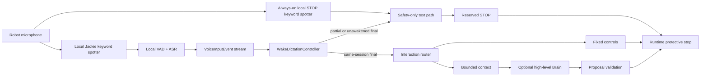

# Jackie Voice Input V0

> **Maturity:** experimental core and mock only. No microphone, model artifact,
> audio upload, or robot hardware is activated by this implementation.

Jackie's voice path is deliberately separate from any Brain provider. A local
audio plugin turns microphone audio into typed events;
`WakeDictationController` enforces the wake session; and a downstream Runtime
must handle deterministic commands before optional open-ended text can reach a
configured Brain.



## Core API

The provider-neutral code lives under `src/longship/audio/`:

- `VoiceInputEventType` defines `wake`, `partial`, `final`, `timeout`, and
  `error`;
- `VoiceInputEvent` carries a session ID, monotonic timestamp, event-dependent
  text, and optional confidence;
- `VoiceInputPort` is an asynchronous event source with `aclose()`;
- `WakeDictationController` owns the armed/listening session state and Runtime
  call tasks; and
- `MockVoiceInput` provides deterministic one-shot replay for tests.

A plugin and Runtime are connected by dependency injection:

```python
from longship.audio import MockVoiceInput, WakeDictationController

voice_input = MockVoiceInput(events)
controller = WakeDictationController(voice_input, runtime)
await controller.run()
```

`runtime` only needs an asynchronous
`handle_text(text: str, *, partial: bool = False)` method. The controller does
not import a scenario Runtime, call a Brain provider, or access a target
adapter.

Normal and safety-path Runtime calls use separate, configurable bounded lanes
(eight pending calls each by default). When a lane is full, its oldest call is
cancelled and the newest input is admitted; `superseded_count` makes that
pressure visible. Runtime implementations must cooperate with cancellation and
must own or shield protective-stop work so cancelling its caller cannot cancel
the stop itself.

## Session rules

The initial state is `armed`. A fresh, newer `WAKE` event moves the controller
to `listening` and records that event's session ID and monotonic time. Only one
non-older `FINAL` with the same session ID enters the normal text route; it then
returns the controller to `armed`. A newer repeated wake replaces the active
session, replayed or delayed wakes older than the controller's all-event time
high-water mark are ignored, and a non-older matching timeout or error returns
to `armed` without calling the Brain. Voice plugins must allocate a fresh
session ID for every accepted wake and preserve event timestamps during delayed
delivery.

Configured wake phrases are stripped only when they occur at the start of an
accepted final transcript. For example, `Jackie, take me to the lobby` becomes
`take me to the lobby`, while `tell me who Jackie is` is unchanged. An empty
post-wake transcript is ignored.

Every partial transcript is injected with `partial=True`. A final transcript
that arrives without a matching wake session uses the same restricted path.
Longship's router permits only the reserved STOP grammar on that path, so
ambient speech cannot become a Brain request. STOP does not require a wake and
can run while an ordinary final transcript is waiting on a slow Brain. A live
plugin must therefore run a small local reserved-STOP keyword detector in
parallel with the Jackie wake detector; it cannot place every recognition path
behind the wake gate.

Wake is not authentication. It grants no task, filesystem, network, Skill, or
actuator authority. A deployment still needs an authenticated source policy,
confirmation rules for risky commands, and a physical emergency stop.

## Local plugin boundary

The reserved reference integration is under
`plugins/speech/voice_inputs/jackie_sherpa_onnx/`. It proposes one composition
that owns the microphone stream and performs local keyword spotting, VAD, and
ASR before emitting `VoiceInputEvent` objects. A parallel always-on
reserved-STOP spotter emits only the safety-path hypothesis; it does not open
ordinary dictation. The directory includes no model weights and has no active
entry point.

Model weights, keyword files, token tables, microphone calibration, echo
cancellation, and evaluation evidence remain external immutable artifacts.
Their code and weight licenses must be reviewed separately. A live mission
must resolve approved digests during deployment preflight, never download a
first-use model while the robot is operating.

A configured Brain receives text and bounded Longship context only. It is not
the microphone, wake-word detector, ASR engine, TTS engine, memory authority,
or safety path.

## Production gates still required

Before enabling a real microphone, a target profile should demonstrate:

1. wake false-accept and false-reject rates in the deployment languages and
   expected noise;
2. reserved STOP latency while ASR, TTS, Runtime, and a Brain provider are busy;
3. echo control proving that Jackie's own speech does not self-trigger;
4. bounded, cancellation-cooperative task and audio-device shutdown under
   plugin failure, with blocking native code isolated behind a worker/process
   boundary;
5. authenticated policies for non-STOP voice controls;
6. no raw ambient-audio persistence or unexpected network egress; and
7. repeatable artifact locks, licenses, rollback, and target qualification.

Until those gates exist, use `MockVoiceInput` for development and treat the
reserved sherpa-onnx directory as an integration design, not an enabled
feature.
