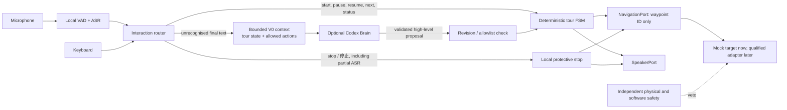

# Voice Tour V0: runtime and extension guide

> **Maturity:** experimental, mock-only, and test-covered. This guide does not
> claim autonomous navigation, collision avoidance, or real-hardware safety
> qualification.

Voice Tour V0 deliberately proves a narrow end-to-end seam before Longship
adds a general mission compiler. It is independently authored for this public
repository and uses only the Python standard library by default.

## Control paths



The stop path calls the navigation target before stopping speech and before any
Brain call. A physical E-stop remains separate; a software zero-velocity
request is not evidence that the robot has stopped. Runtime enters
`safe_stopped` only after typed target evidence; otherwise it remains
`stop_unverified` and cannot restart. Only a qualified target monitor may
produce stopped evidence; an SDK acknowledgement is insufficient. A protective
stop is owned by the runtime, shielded from caller cancellation, and coalesced
while in flight. It is latched, and V0 requires an operator-controlled runtime
reset before a new tour. V0 does not expose a remote reset command; restarting
the demo process under operator supervision is the current reset boundary.

The Python names `TourBrainProposal` and `TourRuntimeEvent` are deliberately
V0-local. They do not implement the broader draft `BrainDecision` or
`RuntimeEvent` proposal schemas yet.

## State and memory

Longship owns the canonical tour ID, current stop, state, and monotonic runtime
revision. The opt-in Codex thread supplies conversational continuity only.
Every request contains the current snapshot, and its response is ignored when
the revision changes while the model is thinking. This prevents a late
`start_tour` or `continue_tour` proposal from applying after pause, cancellation,
or stop.

The context window belongs to the model selected inside Codex. It is not a
memory guarantee, so future deployments should retrieve only relevant episode
summaries and current Skill descriptors into each bounded request. ChatGPT
Voice in the desktop application is a separate user interface; this runtime
still expects an independently qualified ASR transcript and emits text through
`SpeakerPort` for an independently qualified TTS provider.

## Navigation extension seam

A navigation plugin implements:

```python
async def navigate_to(request: NavigationRequest, authority: NavigationAuthority) -> NavigationResult: ...
async def pause(authority: NavigationAuthority) -> None: ...
async def resume(authority: NavigationAuthority) -> None: ...
async def stop(request: NavigationStopRequest) -> StopResult: ...
```

The revocable authority epoch replaces a bare cancellation event. Every
motion-producing provider must check it immediately before starting or
resuming motion, and a cross-process adapter must map it to a target-side
expiring lease. STOP revokes the epoch before its target call. A timed-out
motion task prevents a `safe_stopped` claim; if that task later finishes, the
runtime issues another stop.

The V0 `NavigationRequest` binds a unique request ID, authority epoch,
`map_id`, `map_version`, `route_id`, and `waypoint_id`. Arrival evidence must
echo every field, so a stale same-named waypoint cannot be accepted. The
deployment, not the language model or public scenario,
resolves that semantic request against its immutable map. A production contract
should add artifact digests, arrival tolerance, localization confidence,
geofence, timeout, and state-evidence fields before a real adapter is qualified.

## Unitree walking layers

The experimental G1 target wrapper uses Unitree's separately installed
high-level SDK2 locomotion service. It sends only finite, process-local
ownership-token-bound, base-frame velocity setpoints and asks the service for a
maximum 250 ms duration. Hardware is disabled and velocity limits are zero by
default. The synchronous RPC is not a hard real-time stop channel, and the SDK
timeout is only a best-effort transport hint rather than a wall-clock bound.
Responses after the absolute command deadline are rejected, zero velocity is
requested, and the adapter latches. Reset requires a successful zero-velocity
transport barrier followed by a dwell window of stop-generation-, target-,
boot-, clock-, and lease-correlated whole-body evidence covering base, yaw,
roll/pitch, and joint velocities. The adapter never uses continuous movement
or changes the robot FSM automatically.

An external RL velocity policy is a different provider below navigation. Its
checkpoint remains outside Git and requires an exact artifact digest, separate
weight-license review, observation/action contracts, sim-to-sim evidence, and
protected sim-to-real qualification. It is mutually exclusive with the
onboard high-level locomotion service. The reviewed upstream G1 29-DoF velocity
configuration acts on all 29 joints, so its conservative scope is
`whole_body_motion`.

## Next increments

1. Add streaming ASR and TTS plugins behind the current text/speaker ports.
2. Stabilize waypoint, arrival-evidence, resource-lease, and cancellation
   contracts from the V0 test evidence.
3. Add a mock map/localizer and a target-independent navigation conformance
   suite.
4. Integrate Nav2 or another reviewed navigator without changing the tour FSM.
5. Qualify one Unitree deployment profile in simulation, then in a supervised
   protected environment.
