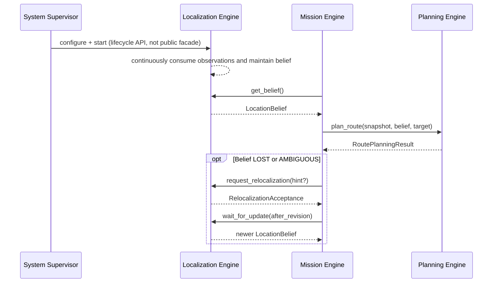

# Localization Engine Public Interface Specification v0.1 (Revised)

> Status: review draft
> Scope: internal public interface of the Navigation Harness
> Dependency: Map Engine v0.1 domain models
> Implementation language: Python; the interface is independent of ROS 2,
> sensor protocols, and concrete localization algorithms

## 1. Definition

The `Localization Engine` is a system-level, continuously running location-state
estimation service. It continuously fuses localization sources against the
active `MapSnapshot` and publishes one unified, immutable `LocationBelief` to
other engines.

It is a deterministic, program-driven probabilistic estimator, not an agent task
whose steps are inferred and decomposed by the Harness.

## 2. Boundary Between Localization Algorithms and the Harness

Localization may contain multiple concrete capabilities:

```text
Metric / SLAM Localizer       ─┐
Topological Localizer         ├─→ Belief Fusion → LocationBelief
Semantic Localizer            ┤
Odometry Provider             ┘
                     Source Health Manager
```

Their fixed data flow, state estimation, quality monitoring, and degradation
logic are not mission-level orchestration.

Mission and the Harness must not:

- start SLAM, semantic localization, and topological localization separately;
- decide which localization source to trust at a particular moment;
- modify candidate weights or prescribe a localization result;
- treat the navigation target as localization evidence.

Mission consumes only `LocationBelief`. When localization is `LOST` or
`AMBIGUOUS`, Mission may pause, terminate, arrange motion-based recovery, or
request relocalization.

## 3. Lifecycle: System Service, Not Mission Session

The revised contract removes these mission-scoped APIs and objects:

```text
start_tracking()
stop_tracking()
LocalizationSession
StartTrackingRequest
```

A navigation mission does not own localization state. On a real robot,
localization normally runs from system startup, multiple missions share one
location stream, and ending a mission does not stop localization.

```text
Runtime Bootstrap / Supervisor
    → select and load the active map version
    → configure and start Localization Engine
    → Localization Engine runs continuously
    → Mission reads LocationBelief immediately after starting
```

Map binding, process startup, shutdown, and reconfiguration belong to Runtime
Bootstrap or the System Supervisor, not the cross-engine public facade. A map
version switch is coordinated by that lifecycle layer and resets the
localization output stream.

### 3.1 Continuous Localization Supervisor

`ContinuousLocalizationService` is an internal system-lifecycle component. It
calls the concrete engine's internal `tick()` at a default `0.25s` period
without changing the public facade:

```text
Camera / Replay Producer
    → Policy observation ingress

ContinuousLocalizationService
    → monotonic TimePoint
    → FixedStartVisualLocalizationEngine.tick()
    → LocationBelief stream
```

Scheduling rules:

- one engine has at most one in-progress tick; model inference never overlaps;
- if inference exceeds the period, obsolete slots are skipped rather than run
  concurrently to catch up;
- `stop()` prevents new ticks, waits for the active tick, and cancels only after
  its timeout;
- an unhandled tick exception moves the service to `FAULTED` and preserves its
  type and text;
- a stopped service cannot be reused; restarting localization requires a new
  engine, service, and belief stream;
- the tick clock and observation timestamps must use the same non-regressing
  clock domain.

The supervisor owns neither camera decoding, a NoMaD executor, nor map
resources. Bootstrap must stop new observation submission first, then stop the
continuous service, and finally close the policy executor.

See [`Localization Runtime Bootstrap v0.1`](localization-runtime.md) for injected
interfaces, complete startup and shutdown order, and fault-cleanup semantics.

## 4. Public Facade

```python
class LocalizationEngine(Protocol):
    def get_belief(self) -> LocationBelief: ...

    async def wait_for_update(
        self,
        request: WaitForUpdateRequest,
    ) -> BeliefUpdateResult: ...

    async def request_relocalization(
        self,
        request: RelocalizationRequest,
    ) -> RelocalizationAcceptance: ...

    def get_status(self) -> LocalizationEngineStatus: ...
```

The facade exposes four capabilities:

| Method | Meaning |
|---|---|
| `get_belief()` | Read the latest location state immediately |
| `wait_for_update()` | Wait for a newer location revision or stream reset |
| `request_relocalization()` | Ask the internal system to broaden search or reinitialize |
| `get_status()` | Read engine health, map binding, and capabilities |

Raw observations do not enter through this facade, and system startup and
shutdown are not controlled through it.

### 4.1 Internal Visual-policy SPI

A concrete visual model connects through the internal
`VisualGoalDistanceBatchPolicy`, not the public facade. The scalar policy
contract remains as a compatibility surface for single-goal consumers:

```text
VisualGoalDistanceBatchRequest
├── snapshot_id
├── candidate[]
│   └── target Node / Anchor / Resource
├── requested_at / max_observation_age_s
├── expected image profile
└── expected model artifact id / digest

VisualGoalDistanceBatchMeasurement
├── candidate_distances[]
│   ├── complete target identity
│   └── temporal_distance
├── observation_time / produced_at
└── actual policy / profile / model artifact
```

The Localization Engine validates every returned identity and compatibility
field. `temporal_distance` is model output, not meters, seconds, probability, or
`LocationBelief.confidence`. Raw tensors, four-frame buffers, image
preprocessing, and model execution belong to the policy plugin. Node state and
belief state belong to Localization.

### 4.2 Initial Fixed-start NoMaD Implementation

The first NoMaD localization implementation is a capability-limited fixed-start
topological tracker. It does not claim arbitrary-start global localization:

```text
WAIT_CONTEXT
→ VERIFY_START
→ SEARCHING_NEXT
→ TRACKING
→ AT_FINAL_NODE

active → LOCALIZATION_LOST / FAULT
```

- the active map must be a one-way chain beginning at `node-0000` and covering
  every node;
- the start is hard-coded to `node-0000`; Bootstrap and callers cannot override
  it;
- every node has exactly one visual localization anchor and one image resource
  with a digest;
- every target image uses the same image profile and model artifact;
- the start requires two consecutive close results;
- tracking compares the current node, expected successor, and bounded forward
  look-ahead candidates in one policy batch;
- a short evidence window combines absolute-close and bounded relative-winner
  evidence; normal transitions advance exactly one node and never regress;
- repeated close evidence for a later candidate enters `LOST` instead of
  silently skipping the expected successor;
- weak local candidate sets publish `DEGRADED`; persistent untrusted sets enter
  `LOST`;
- `LOST` is nonterminal and searches a larger forward-only window; repeated
  close agreement may restore `TRACKING` at a monotonically later node;
- this bounded recovery never searches backward or across the full map and is
  not arbitrary-start global relocalization;
- persistent stale or backend failures retain the existing degraded/fault
  behavior;
- the final node publishes its `NodeLocation`; Mission still decides task
  success;
- stop, speed reduction, trajectories, and control commands are outside the
  Localization Engine.

The fixed-start restriction is exposed explicitly through
`LocalizationCapability.FIXED_START_TOPOLOGICAL_TRACKING`.

## 5. LocationBelief

```text
LocationBelief
├── snapshot_id
├── revision
│   ├── stream_id
│   └── sequence
├── estimate_time
├── published_at
├── status
├── confidence
├── hypotheses[]
└── source_health[]
```

### 5.1 Estimate Status

| `LocalizationStatus` | Meaning |
|---|---|
| `INITIALIZING` | Engine is running but evidence cannot form a valid hypothesis |
| `TRACKING` | A primary hypothesis is usable for normal navigation |
| `DEGRADED` | Primary hypothesis remains usable, but accuracy, freshness, or source health declined |
| `AMBIGUOUS` | Multiple candidate locations cannot be disambiguated safely |
| `LOST` | Tracking was established but can no longer maintain a trustworthy location |
| `UNAVAILABLE` | Current observations or capabilities cannot produce a usable location |

`DEGRADED`, `AMBIGUOUS`, `LOST`, and `UNAVAILABLE` are domain states, not program
exceptions.

### 5.2 Belief Revision

The previous design identified updates with `session_id + sequence`. After
removing sessions, the revised contract uses:

```text
BeliefRevision
├── stream_id
└── sequence
```

- `sequence` increases strictly within one `stream_id`;
- engine restart or active snapshot change requires a new `stream_id`;
- belief content for one revision is immutable;
- callers must not store sequence alone because it cannot detect restart or map
  switch.

### 5.3 Time

- `estimate_time`: observation time represented by the estimate;
- `published_at`: time at which the engine published the belief;
- `TimePoint.clock_id`: explicit clock domain; timestamps with different clock
  IDs cannot be subtracted directly.

## 6. Unified Location Hypothesis

```text
LocationHypothesis
├── hypothesis_id
├── topological_location       # optional Node or Segment
├── semantic_places[]          # optional Map Engine PlaceId values
├── metric_pose                # optional
└── weight                     # optional
```

Rules:

- every hypothesis contains at least one topological location, semantic place,
  or metric pose;
- `TRACKING` and `DEGRADED` have at least one candidate, with the primary
  candidate first;
- `AMBIGUOUS` has at least two meaningful candidates;
- `INITIALIZING`, `LOST`, and `UNAVAILABLE` may have no candidates;
- a present `weight` is in `[0, 1]`, and present weights in one belief should be
  normalized;
- `confidence` describes usability of the entire belief and is not a candidate
  weight;
- when a valid probability cannot be calibrated, use `None` rather than invent
  a score.

### Topological Location

```text
TopologicalLocation
├── NodeLocation(node_id)
└── SegmentLocation(segment_id, progress?)
```

`SegmentLocation.progress` is an optional normalized value in `[0, 1]`. It
represents the robot's position along a directed map segment, not mission
execution progress.

### Metric Pose

```text
MetricPoseEstimate
├── pose                        # Pose3D
└── covariance_6x6             # optional, row-major
```

`pose.frame_id` belongs to the map-coordinate system of the current
`snapshot_id`. A purely topological system may omit metric pose. A purely metric
localizer may temporarily omit topological location before graph projection.

## 7. Update-read Semantics

```python
result = await engine.wait_for_update(
    WaitForUpdateRequest(
        after_revision=current.revision,
        timeout_s=1.0,
    )
)
```

`BeliefUpdateResult.outcome`:

| Outcome | Meaning |
|---|---|
| `UPDATED` | A belief with a higher sequence in the same stream |
| `STREAM_RESET` | Engine restart or map switch; returns latest belief in the new stream |
| `TIMED_OUT` | No update during the wait; returns the current latest belief |

Timeout is normal control flow and does not raise. This long-poll interface does
not freeze ROS topics, callbacks, or `AsyncIterator` into the engine contract.

## 8. Relocalization Semantics

```python
acceptance = await engine.request_relocalization(
    RelocalizationRequest(hint=hint, reason="belief_lost")
)
```

A relocalization request asks the internal system only to broaden search, reset
its estimate, or revalidate candidates. It contains no motion task.

`RelocalizationDisposition`:

- `ACCEPTED`: accepts a new request and returns `relocalization_id`;
- `ALREADY_RUNNING`: an equivalent request is active and may return its ID;
- `UNAVAILABLE`: current capability or observations cannot support
  relocalization; `detail_code` explains why.

Relocalization changes state asynchronously and does not block until success.
Callers continue reading belief:

```text
request_relocalization()
        ↓ acceptance
wait_for_update() / get_belief()
        ↓
INITIALIZING / AMBIGUOUS / TRACKING / LOST
```

The Localization Engine never rotates, reverses, or explores with the robot. If
motion is needed to obtain a new view, Mission arranges it through external
motion or route-execution capabilities, then observes localization again or
submits another request. Active-localization motion does not enter the public
Localization facade.

`LocalizationHint` contains existing evidence only, such as the last trusted
location, an operator-specified start region, GNSS, an AprilTag, or an external
location result. The navigation target and expected route cannot be hints.

## 9. Engine Status Is Distinct from Belief Status

`LocationBelief.status` describes estimate quality.
`LocalizationEngineStatus.state` describes service health. They must not be
merged.

For example:

```text
Engine state = RUNNING
Belief status = LOST
```

The program and observation pipeline are healthy, but the robot's current
location is unknown.

```text
LocalizationEngineStatus
├── state                       # STARTING / RUNNING / DEGRADED / FAULTED / STOPPED
├── snapshot_id                 # active map
├── stream_id
├── capabilities
├── latest_sequence
├── last_update_at
├── active_relocalization_id
└── detail_code
```

## 10. Raw Observations and Concrete Localizers

```text
Sensor / State Services
        ↓
Internal Observation Ports
        ↓
Localization Sources
├── metric / SLAM adapter
├── topological localizer
├── semantic localizer
└── odometry provider
        ↓
Belief Fusion + Source Health
        ↓
LocationBelief
```

Raw images, point clouds, and odometry are not cross-engine DTOs. A concrete
localizer may be an in-process algorithm or an external service adapter; Mission
and Planning see no difference. How an external route-execution system obtains
closed-loop pose or odometry is a system-integration concern, not mission-level
orchestration in the Localization facade.

## 11. State Ownership

| State | Owner |
|---|---|
| Active map and system lifecycle configuration | Runtime Bootstrap / System Supervisor |
| Published versioned map data | Map Engine |
| Continuous location, candidates, and fusion state | Localization Engine |
| Raw sensor buffers and localization-source health | Localization Engine implementation |
| Current mission state and recovery budget | Mission Engine |
| Routes and planning constraints | Planning / Mission Engine |
| Active `RoutePlan` traversal | Harness `LocalTrajectoryEngine`, resolved from belief |
| Control-execution progress | External Route Execution System; future reports may use `RouteExecutionPort` |
| LIO / scan-to-map internal state | External Geometry Service |

Mission does not own a Localization Session. It stores only the most recent
`BeliefRevision` it consumed and verifies that the planning snapshot equals
`LocationBelief.snapshot_id`.

## 12. Error Model

| Error code | Meaning | Usually retryable |
|---|---|---|
| `INVALID_REQUEST` | Parameters or revision violate the contract | No |
| `ENGINE_NOT_RUNNING` | Lifecycle layer has not started localization or already stopped it | Yes |
| `ENGINE_FAULTED` | Infrastructure or internal engine failure | Cause-dependent |
| `INCOMPATIBLE_SNAPSHOT` | Active map lacks required schema or resources | No |
| `CAPABILITY_UNAVAILABLE` | Requested relocalization capability does not exist | No |
| `BACKEND_UNAVAILABLE` | Required source or external backend is unavailable | Yes |

Localization loss, ambiguity, temporary observation shortage, and unsuccessful
relocalization are states, not exceptions.

## 13. Typical Sequence



## 14. Code Organization

```text
localization_engine/
├── interface.py               # sole public facade and structured errors
├── models.py                  # cross-engine DTOs
└── implementation/            # future implementation; other engines cannot import
    ├── observation_sync.py
    ├── source_registry.py
    ├── sources/
    │   ├── metric.py
    │   ├── topological.py
    │   ├── semantic.py
    │   └── odometry.py
    ├── belief_fusion.py
    ├── source_health.py
    └── tracking_state.py
```

Other engines may import only `localization_engine.interface` and
`localization_engine.models`; they cannot bypass the facade to control concrete
localizers. If an external route-execution system needs localization data, the
system-integration layer creates a separate adapter without changing the
mission-facing public contract.

## 15. Revision Decisions

1. The Localization Engine is a deterministic, continuously running state
   estimator, not a Harness subtask.
2. SLAM, semantic, topological, and odometry sources are fused internally under
   fixed rules and are not orchestrated individually by Mission.
3. Mission-scoped sessions, `start_tracking()`, and `stop_tracking()` are
   removed.
4. System lifecycle and map binding move to Runtime Bootstrap or the System
   Supervisor.
5. `BeliefRevision(stream_id, sequence)` replaces session-local sequence.
6. Relocalization is asynchronous and observed through subsequent
   `LocationBelief` values.
7. Estimate status and engine-health state remain explicitly separate.
