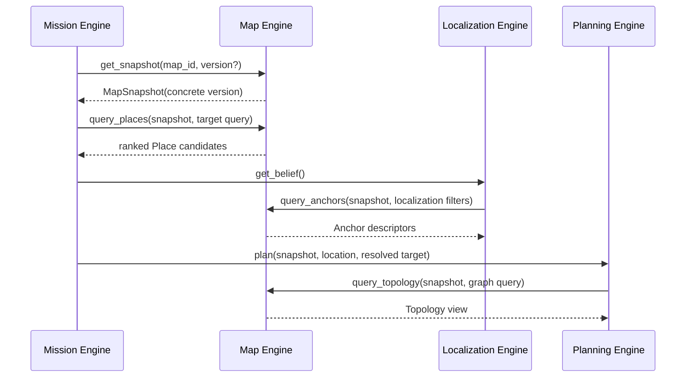

# Map Engine Public Interface Specification v0.1

> Status: review draft
> Scope: internal public interface of the Navigation Harness
> Implementation language: Python; the interface is independent of ROS 2,
> databases, and concrete map formats

## 1. Definition

The `Map Engine` provides the Navigation Harness with **version-pinned,
read-only, queryable environment knowledge**.

It answers "what exists in this map version," not "where is the robot," "which
route should it take," or "can it pass safely right now."

## 2. Established Boundary

### Map Engine responsibilities

- resolve `map_id + version` to an immutable `MapSnapshot`;
- query places, aliases, and target attachments;
- query topological nodes and directed segments;
- query visual, metric, semantic, and other anchors;
- resolve map resource IDs to opaque resource references;
- guarantee version-consistent results for every query against one
  `MapSnapshot`.

### Map Engine non-responsibilities

- map recording, editing, annotation, or version publication;
- SLAM, LIO, scan-to-map, or current robot pose estimation;
- route search, cost decisions, or replanning;
- dynamic obstacles, temporary blockage, or Safety Guardian behavior;
- current mission, route, or execution progress;
- embedding large resources such as point clouds or images directly in public
  DTOs.

A map-production system may publish a new map version but must never mutate a
published snapshot in place.

## 3. Facade

The Map Engine exposes one public facade:

```python
class MapEngine(Protocol):
    async def get_snapshot(
        self, selector: MapSelector
    ) -> MapSnapshot: ...

    async def query_places(
        self, snapshot: MapSnapshot, query: PlaceQuery
    ) -> PlaceQueryResult: ...

    async def query_topology(
        self, snapshot: MapSnapshot, query: TopologyQuery
    ) -> TopologyQueryResult: ...

    async def query_anchors(
        self, snapshot: MapSnapshot, query: AnchorQuery
    ) -> AnchorQueryResult: ...

    async def resolve_resources(
        self, snapshot: MapSnapshot, resource_ids: tuple[ResourceId, ...]
    ) -> ResourceQueryResult: ...
```

There is no generic `query(dict) -> dict`, because it would discard type,
boundary, and compatibility guarantees.

## 4. MapSnapshot Semantics

`MapSnapshot` is an immutable **version token and capability description**, not
the complete map data:

```text
MapSnapshot
├── snapshot_id
├── map_id
├── version
├── schema_version
├── content_digest
├── published_at
├── map_frame                    # optional
└── capabilities
```

Rules:

1. `MapSelector.version=None` resolves the currently published version exactly
   once, during `get_snapshot()`.
2. The returned `MapSnapshot.version` must be concrete.
3. Publishing a new map must not change any query result for an existing
   `MapSnapshot`.
4. One mission must pass the same `MapSnapshot` to Mission, Localization,
   Planning, and Execution.
5. A `MapSnapshot` is not a lease, so the public interface has no
   `release_snapshot()`; caching and resource reclamation are implementation
   details.

## 5. Four Query Families

| Interface | Primary caller | Result | Decision it does not make |
|---|---|---|---|
| `query_places` | Mission Engine / Target Resolver | Ranked place candidates | Which candidate is the mission target |
| `query_topology` | Planning, Execution | Nodes and directed segments | Route search or final cost |
| `query_anchors` | Localization, Execution | Anchor descriptors and resource IDs | Localization or navigation inference |
| `resolve_resources` | Localization and Execution adapters | Resource kinds and opaque locators | Resource interpretation or geometry algorithms |

### 5.1 Place Queries

Place queries support text, explicit `place_id`, type, and tag filters.

`rank_score` is only a ranking value and is not a probability. Zero or multiple
candidates are normal results:

- zero candidates: the Target Resolver decides whether to fail, change the
  query, or ask an upper layer;
- multiple candidates: the Target Resolver disambiguates using mission context;
- the Map Engine does not raise `AMBIGUOUS_TARGET`.

### 5.2 Topology Queries

Topology consists of `TopologyNode` and `SegmentDescriptor`. One key convention
is fixed:

> A `SegmentDescriptor` always represents one **directed** traversable
> connection.

A bidirectional corridor is therefore represented by two segments. Each
direction can have different constraints, anchors, and execution metadata, and
Execution never has to reinterpret direction.

An empty `TopologyQuery` returns the complete navigation topology. Selecting
nodes or segments returns a local view, and `expand_hops` controls adjacency
expansion.

The Map Engine returns facts or publication-time metadata such as length,
estimated duration, suggested speed, required capabilities, and tags. The
Planning Engine decides how to combine them into costs.

### 5.3 Anchor Queries

An anchor binds a map entity to perceptual or geometric evidence:

```text
AnchorDescriptor
├── anchor_id
├── kind
├── purposes
├── attached_to                 # Place / Node / Segment
├── pose                        # optional
└── resource_ids
```

`kind` describes what an anchor is; `purposes` describes what it may be used
for. One visual anchor may support both `LOCALIZATION` and `COMPLETION`.

### 5.4 Resource Resolution

Large objects such as images, point clouds, and submaps do not enter
`MapSnapshot`, Anchor, or Segment DTOs directly. They are referenced through
`ResourceId` and resolved to:

```text
ResourceDescriptor
├── resource_id
├── kind
├── locator                     # opaque
├── media_type
├── content_digest
└── size_bytes
```

Callers must not parse `locator`; they pass it to the corresponding resource
loader or Geometry Adapter. Switching from local files to object storage or an
external Geometry Service then requires no Map Engine domain-interface change.

## 6. State Ownership

| State | Owner |
|---|---|
| Published map versions and indexes | Map Engine / map repository |
| `MapSnapshot` selected for the current mission | Mission Engine |
| Probabilistic current location | Localization Engine |
| Current `RoutePlan` | Produced by Planning; referenced by Mission; read-only in the Local Trajectory Engine |
| Active traversal and target-resource binding | Harness `LocalTrajectoryEngine`, not Map Engine |
| Control-execution progress | External Route Execution System, not Map Engine |
| Temporary closures, blockage, and retry budgets | Mission Engine / Planning input; never written into Map Engine |
| Point-cloud map data and scan-to-map state | External Geometry Service |

The Map Engine may maintain caches, but caches are not domain state and must not
change query semantics.

## 7. Consistency and Determinism

For the same `MapSnapshot + Query`:

- domain content must remain stable;
- backend reloads and cache eviction must not change results;
- every returned object carries `snapshot_id`;
- batched ID queries may partially succeed, with missing IDs returned through
  `missing_*_ids`;
- an empty query result is not a system error.

Dynamic information is not written into a snapshot. If a segment is temporarily
blocked during a mission, Mission and Planning use a mission-scoped exclusion.
It becomes a map fact only after the map-management system publishes a new
version.

## 8. Error Model

Implementations report infrastructure and contract errors through
`MapEngineError`:

| Error code | Meaning | Usually retryable |
|---|---|---|
| `MAP_NOT_FOUND` | `map_id` does not exist | No |
| `VERSION_NOT_FOUND` | Requested version does not exist | No |
| `SNAPSHOT_NOT_FOUND` | Snapshot cannot be resolved again | Backend-dependent |
| `INCOMPATIBLE_SCHEMA` | Runtime does not support the map schema | No |
| `INVALID_QUERY` | Query violates the contract | No |
| `CAPABILITY_UNAVAILABLE` | Map lacks a requested capability | No |
| `BACKEND_UNAVAILABLE` | Map repository is temporarily unavailable | Yes |
| `CORRUPT_MAP` | Integrity validation failed | No |

Missing places, nodes, segments, anchors, or resources should normally produce
empty results or `missing_*_ids`, not elevate ordinary domain absence into a
system exception.

## 9. Typical Sequence



## 10. Code Organization

```text
map_engine/
├── interface.py               # sole public facade and structured errors
├── models.py                  # cross-engine DTOs
├── static.py                  # generic read-only single-snapshot implementation
└── implementation/            # future implementation; other engines cannot import
    ├── version_store.py
    ├── place_index.py
    ├── topology_store.py
    ├── anchor_store.py
    └── resource_registry.py
```

Other engines may import only `map_engine.interface` and `map_engine.models`.

Readers for concrete map formats do not belong in the core Map Engine. For
example, the NoMaD adaptive-topomap reader lives in the corresponding policy
plugin's `longship_adapter`. It converts external
`manifest.json / edges.json / images/` artifacts into generic nodes, segments,
anchors, and resources, then injects them into `StaticMapEngine`. Dependency
direction is always "plugin adapter depends on Harness contracts"; the core
Harness never imports NoMaD.

## 11. Decisions for Review

1. **Must map selection provide `map_id` explicitly?**
   v0.1 recommends yes. Automatically choosing a map from the current location
   is policy above Mission and Localization.

2. **Do we accept the directed-segment convention?**
   v0.1 recommends yes. Representing a bidirectional passage with two segments
   substantially simplifies Planning and the external route-execution
   interface.

3. **Should resource locators remain opaque?**
   v0.1 recommends yes. The Map Engine owns indexing and version consistency;
   adapters read resources, while the Geometry Service continues to own 3D map
   data.
