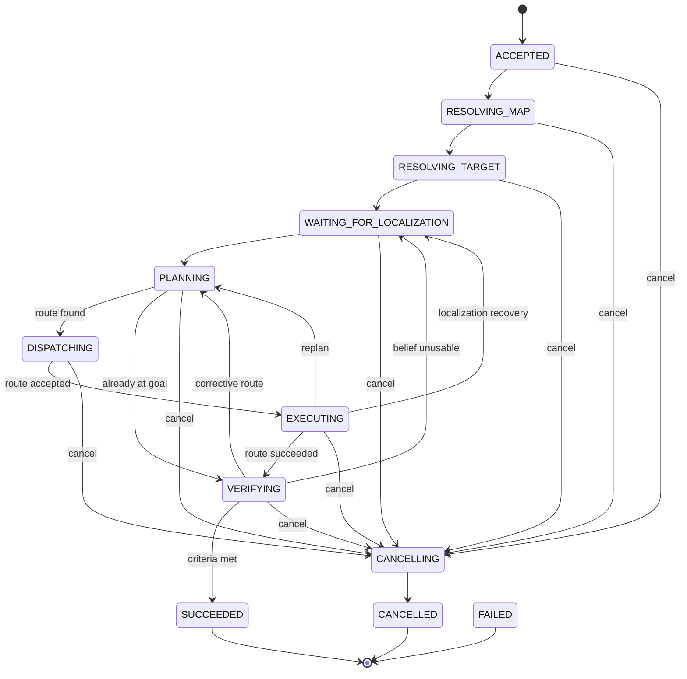
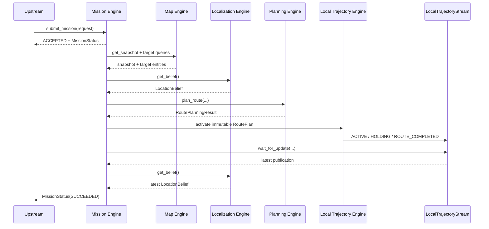

# Navigation Mission Engine Public Interface and State Machine v0.1

> Status: review draft
> Scope: the only navigation mission-level orchestration module inside the
> Navigation Harness
> Dependencies: Map Engine, Localization Engine, Planning Engine,
> `LocalTrajectoryStream`, and optionally a future `RouteExecutionPort`
> Contract language: Python types; independent of ROS 2, LLMs, databases, and
> concrete navigation algorithms

## 1. Definition

The `Navigation Mission Engine` is the only Harness module that owns the
lifecycle of a navigation subtask. It advances a structured navigation request
through target resolution, localization admission, global planning,
`RoutePlan` activation, failure recovery, and final success verification.

This ownership covers one `navigate_to` Skill call. Longship Runtime still owns
the top-level Mission, Task Graph, resource leases, cancellation epochs, and
Safety coordination.

It answers:

> What must this task accomplish, which stage is active, which deterministic
> capability should run next, and did the task ultimately succeed?

Mission is a programmatic task orchestrator, not a localization, planning, or
route-execution algorithm.

## 2. Public Facade

```python
class NavigationMissionEngine(Protocol):
    async def submit_mission(
        self,
        request: NavigationMissionRequest,
    ) -> MissionSubmissionResult: ...

    def get_status(
        self,
        mission_id: NavigationMissionId,
    ) -> MissionStatus: ...

    async def wait_for_update(
        self,
        request: MissionUpdateRequest,
    ) -> MissionUpdateResult: ...

    async def control(
        self,
        request: MissionControlRequest,
    ) -> MissionControlResult: ...
```

| Method | Meaning |
|---|---|
| `submit_mission()` | Accept or reject a task without waiting for navigation to finish |
| `get_status()` | Read the latest immutable task state immediately |
| `wait_for_update()` | Wait for a newer revision, terminal state, or timeout |
| `control()` | Request mission-level pause, resume, or controlled cancellation |

There is no long-blocking `run_mission()`. Versioned status lets callers observe
long-running tasks across processes and network reconnections and issue control
requests independently.

## 3. Instance and Concurrency Model

v0.1 specifies:

- one Mission Engine instance is bound to one robot runtime;
- at most one non-terminal Mission exists at a time;
- completed tasks remain queryable through `get_status()`;
- multiple robots use isolated runtime instances rather than adding `robot_id`
  to every DTO;
- submitting another `mission_id` while one task is active returns
  `REJECTED(ENGINE_BUSY)` normally.

These are task-ownership constraints, not a threading or process model for an
external execution system.

## 4. NavigationMissionRequest

```text
NavigationMissionRequest
├── mission_id                  # idempotency key
├── execution_context           # Longship Mission/Task/SkillCall/lease/epoch
├── requested_at
├── map_selector                # explicit map_id, optionally pinned version
├── target                      # logical target
├── route_constraints           # Planning hard constraints
├── route_preferences           # Planning soft preferences
├── initial_planning_context    # initial temporary facts
├── execution_limits            # limits for an external executor
├── success_criteria            # final Mission verification rules
└── budget                      # finite recovery budget
```

`execution_context` is an immutable snapshot of authority granted by Longship
Runtime. Mission may consume its resource lease and cancellation epoch but may
not create, renew, or broaden the lease.

Submission waits only for acceptance or rejection. It does not wait for map
queries, target resolution, planning, or route completion. An accepted task is
advanced by the Mission Engine in the background.

### 4.1 Idempotency

- repeated submission of the same semantic request with the same `mission_id`
  returns `ALREADY_EXISTS` and current status;
- reusing a `mission_id` with a different target, map, constraints, or budget
  raises `IDEMPOTENCY_CONFLICT`;
- ordinary transport retries never create a second task.

`ACCEPTED` and `ALREADY_EXISTS` return `status` without `rejection`.
`REJECTED` returns `rejection` without `status`. The only normal v0.1 submission
rejection is `ENGINE_BUSY`. Invalid structure is an interface error, while
target-resolution failure becomes terminal `MissionFailure` after acceptance.

## 5. Target Input and Resolution

`MissionTargetSpec` supports four target kinds:

| Kind | Meaning of `value` | Resolution |
|---|---|---|
| `PLACE_ID` | `PlaceId` string | Query and validate a map place |
| `NODE_ID` | `NodeId` string | Query and validate a topology node |
| `ANCHOR_ID` | `AnchorId` string | Query the anchor and project it to its Node or Place |
| `PLACE_QUERY` | Place text | Use Map Engine place queries |

The Mission Parser performs only structure validation and normalization. If an
upper Harness or LLM already interpreted natural language, it submits the
structured target directly; Mission does not require an LLM.

Multiple `PLACE_QUERY` candidates default to `REQUIRE_UNIQUE`.
`SELECT_TOP_RANKED` is permitted only when the caller opts in explicitly,
because place ranking is not localization evidence and a navigation target must
not bias Localization.

The resolved object is:

```text
ResolvedTarget
├── target_ref
├── snapshot_id
├── basis
├── candidate_node_ids[]
├── place_id
├── source_anchor_id
└── completion_anchor_ids[]
```

v0.1 requires projection to at least one candidate node. An anchor attached
partway through a segment that cannot project to a node returns
`TARGET_UNSUPPORTED`; Mission does not hide a precise segment target from the
planner.

## 6. Map Snapshot Policy

Every Mission calls this once in `RESOLVING_MAP`:

```python
snapshot = await map_engine.get_snapshot(request.map_selector)
```

Target resolution, localization, planning, and route commands then bind to that
`snapshot_id`. A Mission does not follow newly published map versions
automatically.

If system Localization switches to another snapshot or an external executor
reports `MAP_SNAPSHOT_CHANGED`, v0.1 terminates with `MAP_CONTEXT_CHANGED`.
Migrating automatically would require target re-resolution, constraint
revalidation, and localization-stream reset. The caller submits a new Mission
instead of changing the old task implicitly.

## 7. Mission State Machine



Pause transitions are omitted from the diagram for readability:

```text
pausable non-terminal state → PAUSING → PAUSED → RESUMING → previous safe state
```

### 7.1 State Meanings

| State | Mission Engine activity |
|---|---|
| `ACCEPTED` | Task record exists; no downstream capability called yet |
| `RESOLVING_MAP` | Pin an immutable `MapSnapshot` |
| `RESOLVING_TARGET` | Bind logical target to map entities and candidate nodes |
| `WAITING_FOR_LOCALIZATION` | Wait for a plannable location and request relocalization if needed |
| `PLANNING` | Issue one deterministic `plan_route()` request |
| `DISPATCHING` | Activate a new `RoutePlan` trajectory runtime |
| `EXECUTING` | Observe `LocalTrajectoryStream` and optional external feedback |
| `VERIFYING` | Apply mission success criteria to the latest belief |
| `PAUSING / PAUSED / RESUMING` | Coordinate task and external-route pause state |
| `CANCELLING` | Cancel the active route and wait for its terminal state |
| `SUCCEEDED / FAILED / CANCELLED` | Terminal state with no further transitions |

## 8. Normal Flow



Mission only connects public capabilities. It neither reads raw sensors, enters
the planner search process, nor handles control-rate data from an external
executor.

## 9. Localization Admission and Relocalization

A belief used for planning must satisfy at least:

- `belief.snapshot_id == mission.snapshot_id`;
- status is `TRACKING`, or policy permits this `DEGRADED` result;
- a hypothesis projects to the topology graph;
- confidence meets `MissionSuccessCriteria` or runtime policy.

`AMBIGUOUS`, `LOST`, and `UNAVAILABLE` are not exceptions. Mission enters
`WAITING_FOR_LOCALIZATION`, calls `request_relocalization()` while budget
permits, and observes newer beliefs through `wait_for_update()`.

Mission never invokes SLAM, semantic localization, or odometry modules
individually and never uses the target place as a relocalization hint.

## 10. Planning and Replanning

Every planning attempt builds a complete explicit request:

```text
pinned MapSnapshot
+ latest usable LocationBelief
+ ResolvedTarget → PlanningTarget
+ RouteConstraints
+ RoutePreferences
+ current PlanningContext
```

Planning retains no mission state. Replanning means Mission updates location or
mission-scoped temporary facts and sends another request.

Typical update rules:

- `BLOCKED / NO_PROGRESS` with a related segment adds it to
  `unavailable_segment_ids`;
- `OFF_ROUTE` reads the latest belief and replans;
- `PLAN_INVALIDATED` updates context from structured evidence and replans;
- `LOCALIZATION_UNAVAILABLE` enters localization recovery first;
- `retryable_same_route=True` may resubmit the same immutable route with a new
  `RouteCommandId` while budget permits;
- external `replan_recommended` is advice; Mission owns the decision.

The old RouteCommand reaches a terminal state before a new route is submitted.
v0.1 has no in-place `replace_route()`.

## 11. Final Success Verification

`RouteExecutionState.SUCCEEDED` means only that an external system completed its
route command. Mission must still enter `VERIFYING`.

Evidence may include:

- the latest primary belief hypothesis is at a target candidate node;
- the latest belief contains the target Place;
- external completion reports an allowed completion anchor;
- localization and Mission use the same pinned snapshot;
- localization status and confidence meet `MissionSuccessCriteria`.

Verification produces structured `GoalVerificationEvidence`. The default
requires target-node evidence; precise docking tasks may additionally require a
completion anchor. With insufficient evidence, Mission may relocalize or plan a
corrective route within budget, otherwise it fails with
`GOAL_VERIFICATION_FAILED`.

`ALREADY_AT_GOAL` follows the same verification path without creating a
`RouteCommand`.

## 12. Finite Recovery Budget

```text
MissionBudget
├── mission_timeout_s
├── localization_wait_timeout_s
├── max_relocalization_attempts
├── max_planning_attempts
├── max_route_submissions
└── max_same_route_retries
```

Every recovery loop consumes explicit budget. Mission cannot repeat
relocalization, planning, failure, and replanning forever. Exhaustion publishes
`FAILED(RECOVERY_BUDGET_EXHAUSTED)`.

`MissionProgress` exposes accumulated counts and task-scoped unavailable
segments for diagnostics and replay. Those temporary facts are never written
back to the Map Engine.

## 13. Pause, Resume, and Cancel

`control()` expresses mission intent, not a chassis safety command:

- the initial version does not yet bind Mission control to trajectory runtime;
- after route execution is integrated, Mission may forward `PAUSE`, `RESUME`, or
  `CANCEL` through `RouteExecutionPort.control()` and await external
  confirmation;
- before route submission, Mission pauses or cancels at safe checkpoints and
  never fabricates external execution state;
- pause and cancel do not replace emergency stop, which belongs to external
  Safety and Platform systems;
- terminal Missions reject new control actions.

`MissionControlCommandId` makes control requests idempotent. The semantics of one
ID cannot change.

## 14. MissionStatus and State Ownership

```text
MissionStatus
├── mission_id / revision
├── state
├── created_at / updated_at
├── progress
├── snapshot_id
├── resolved_target
├── latest_belief_revision
├── latest_route_id / command_id
├── latest_execution_state
├── completion
├── failure
└── cancellation_reason
```

Mission may store the last external state summary it consumed but cannot rewrite
external route-execution state.

| Data | Sole owner |
|---|---|
| Mission lifecycle, budgets, recovery history, and success decision | Mission Engine |
| Map content and published versions | Map Engine |
| Continuous location belief | Localization Engine |
| Route computation semantics | Planning Engine |
| Active traversal and local-trajectory publication | Harness `LocalTrajectoryEngine` |
| Active control command, platform progress, and external terminal state | External Route Execution System |
| Emergency stop, safety state, and control | External Safety / Execution / Platform |

`MissionRevision.sequence` increases strictly within one `mission_id`. One
revision is immutable, and `wait_for_update()` timeout is normal control flow.

## 15. Terminal States and Invariants

Terminal states are:

```text
SUCCEEDED / FAILED / CANCELLED
```

Rules:

- terminal states do not transition;
- `SUCCEEDED` has `completion` and no `failure`;
- `FAILED` has `failure` and no `completion`;
- `CANCELLED` may have a cancellation reason and has no completion;
- cancellation reason appears only in `CANCELLING` or `CANCELLED`;
- `revision.mission_id == status.mission_id`;
- `ResolvedTarget`, belief, `RoutePlan`, and `RouteCommand` use the same
  `snapshot_id`;
- at most one non-terminal `RouteCommand` exists at a time;
- Mission cannot submit a replacement route while the external command remains
  non-terminal.

## 16. Normal Failures and Exceptions

The following are task-domain outcomes represented by
`MissionStatus(state=FAILED)`:

- map or target unavailable in current task context;
- target missing, ambiguous, or unsupported;
- localization wait timeout;
- no route under current inputs;
- normal external route rejection;
- route-execution failure;
- final arrival-verification failure;
- exhausted recovery budget or mission time.

`MissionFailure` preserves structured downstream reasons such as
`NoRouteReason`, `RouteSubmissionRejectionReason`, and
`RouteExecutionFailureReason`; it cannot store only free-form text.

Only interface, addressing, idempotency, or infrastructure failures raise
`MissionEngineError`:

```text
INVALID_REQUEST
MISSION_NOT_FOUND
IDEMPOTENCY_CONFLICT
ENGINE_UNAVAILABLE
DEPENDENCY_FAILURE
INTERNAL_FAILURE
```

## 17. Suggested Internal Structure

```text
mission_engine/
├── interface.py               # public facade and structured errors
├── models.py                  # public DTOs
└── implementation/
    ├── mission_parser.py      # request validation and normalization
    ├── target_resolver.py     # Map queries and ResolvedTarget
    ├── mission_executive.py   # state machine and dependency calls
    ├── recovery_policy.py     # failure classification and bounded recovery
    ├── goal_verifier.py       # final success criteria
    └── mission_store.py       # revisions, idempotency, and durable state
```

Internal components are not new top-level engines. Other modules may import only
`mission_engine.interface` and `mission_engine.models`, not operate directly on
`MissionExecutive` or state storage.

## 18. v0.1 Baseline

1. Mission is the only task-level orchestrator inside the Harness.
2. Its facade is `submit_mission / get_status / wait_for_update / control`.
3. One instance represents one robot and has one active Mission at a time.
4. Every Mission pins one `MapSnapshot` and never switches maps implicitly.
5. Target resolution belongs to Mission; Planning consumes only a projected
   `PlanningTarget`.
6. Localization and Planning remain deterministic capabilities whose algorithms
   are not manipulated step by step by upper layers.
7. The current Harness outputs `LocalTrajectoryStream`; a future execution
   lifecycle may integrate through `RouteExecutionPort`.
8. External route success still requires mission-level arrival verification.
9. Every recovery loop has an explicit budget.
10. This package defines public contracts and state-machine semantics only; it
    contains no runtime implementation.
