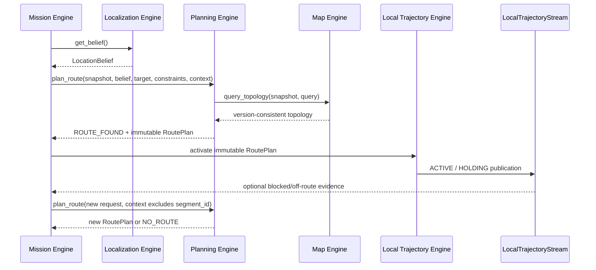

# Planning Engine Public Interface Specification v0.1

> Status: review draft
> Scope: internal public interface of the Navigation Harness
> Dependencies: Map Engine v0.1 and Localization Engine v0.1 domain models
> Implementation language: Python; the interface is independent of ROS 2,
> search algorithms, and concrete local-navigation methods

## 1. Definition

The `Planning Engine` is a deterministic global-route computation service.
Given a pinned map snapshot, location state, resolved target, hard constraints,
and mission-scoped temporary context, it returns an immutable topological route
or a structured no-route result.

It answers:

> Starting from this location, which directed segments should be traversed in
> order to reach this resolved target under the current constraints?

The Planning Engine does not run missions continuously, consume sensor streams,
or decide when to replan.

## 2. Relationship to the Harness and Mission Engine

Planning is not an agent subtask that requires Harness reasoning. Its internal
flow is fixed:

```text
Request Validation
→ Start / Goal Projection
→ Topology Query
→ Constraint Filtering
→ Route Search and Costing
→ Route Validation
→ RoutePlan
```

The Mission Engine orchestrates only when to invoke that flow:

- request initial planning after obtaining a usable `LocationBelief`;
- assemble a new `PlanningContext` and request planning again after an external
  trajectory consumer or future `RouteExecutionPort` reports blockage,
  deviation, or plan invalidation;
- when Planning reports unusable localization or an ambiguous start, decide
  whether to wait, request relocalization, schedule recovery, or terminate.

The Mission Engine never selects the search algorithm, steps through planner
internals, or mutates open and closed search sets.

## 3. Public Facade

```python
class PlanningEngine(Protocol):
    async def plan_route(
        self,
        request: RoutePlanningRequest,
    ) -> RoutePlanningResult: ...
```

v0.1 does not provide:

- `start_planning()` / `stop_planning()`: Planning has no continuous session;
- `replan()`: replanning is another `plan_route()` call with new context;
- `validate_route()`: complete route validation is a mandatory internal stage of
  `plan_route()`;
- `get_next_segment()`: the Harness `LocalTrajectoryEngine` resolves the
  current traversal from `LocationBelief`;
- `plan_local_trajectory()`: the Harness runtime generates short-lived
  trajectories through an injected policy plugin;
- generic `plan(dict) -> dict`: it would destroy type and version guarantees.

## 4. Request Model

```text
RoutePlanningRequest
├── request_id
├── requested_at
├── snapshot                    # pinned MapSnapshot
├── location_belief             # one immutable location publication
├── target                      # planner-facing resolved target
├── constraints                 # hard constraints
├── preferences                 # soft preferences
└── context                     # current mission's temporary facts
```

### 4.1 Snapshot Consistency

The following must hold:

```text
request.snapshot.snapshot_id
== request.location_belief.snapshot_id
```

The planner queries topology through the injected Map Engine against this
`MapSnapshot`. Publishing a new map version cannot change the meaning of the
current request. A mismatch is a `SNAPSHOT_MISMATCH` contract error.

### 4.2 PlanningTarget

Natural-language target understanding and place disambiguation belong to the
Mission Engine's Target Resolver. The Planning Engine does not receive text such
as "go to the east restroom." It receives:

```text
PlanningTarget
├── target_ref
├── candidate_node_ids[]
├── place_id                    # optional, for traceability only
└── completion_anchor_ids[]     # optional, for later arrival checks
```

`candidate_node_ids` are permissible entrances or stopping nodes for one logical
target. The planner may choose the lowest-cost reachable node, but must never
hide ambiguity between different places inside this candidate set.

A future Mission Engine `ResolvedTarget` should contain or convert to a
`PlanningTarget`. Planning never depends backward on Mission's internal models.

### 4.3 Start Projection

The planner selects a topological hypothesis from
`LocationBelief.hypotheses` and records it as:

```text
PlannedStart
├── belief_revision
├── hypothesis_id
└── topological_location        # NodeLocation or SegmentLocation
```

Rules:

- `TRACKING`, or `DEGRADED` satisfying a fixed admission threshold, is normally
  plannable;
- `LOST`, `INITIALIZING`, and `UNAVAILABLE` return
  `NO_ROUTE / LOCATION_UNUSABLE`;
- multiple starts that cannot be disambiguated safely return
  `NO_ROUTE / START_AMBIGUOUS`;
- the planner neither requests relocalization nor biases localization toward the
  navigation target;
- if the start lies partway through a directed segment, the first
  `PlannedTraversal.entry_progress` may be greater than zero to represent only
  the remaining portion.

The versioned planner-admission policy, not ad hoc LLM reasoning, determines
whether a location is reliable enough.

## 5. Keep the Three Planning Inputs Separate

### 5.1 RouteConstraints: Hard Constraints

```text
RouteConstraints
├── robot_capabilities
├── forbidden_segment_ids
├── forbidden_node_ids
├── forbidden_segment_tags
├── max_total_distance_m
└── max_total_duration_s
```

A route is invalid if it violates any hard constraint. `robot_capabilities`
matches `SegmentDescriptor.required_capabilities` from the Map Engine.

### 5.2 RoutePreferences: Soft Preferences

```text
RoutePreferences
├── objective                   # shortest / fastest / balanced
├── preferred_segment_tags
└── avoided_segment_tags
```

Soft preferences rank otherwise valid routes and must not filter out the only
reachable route.

### 5.3 PlanningContext: Mission-scoped Temporary Facts

```text
PlanningContext
├── unavailable_segment_ids
├── unavailable_node_ids
└── extra_segment_costs
```

These facts normally come from execution feedback during one mission, such as a
temporarily blocked segment. The Mission Engine aggregates and passes them
explicitly:

- they are not written into the Map Engine;
- they do not become permanent map facts;
- the Planning Engine does not remember them implicitly across requests;
- a later request does not inherit them unless it carries them again.

## 6. Result Model

```text
RoutePlanningResult
├── request_id
├── snapshot_id
├── planned_at
├── outcome
├── selected_start              # optional
├── selected_goal               # optional
├── route_plan                  # present for ROUTE_FOUND
└── failure                     # present for NO_ROUTE
```

`PlanningOutcome` has three values:

| Outcome | Meaning |
|---|---|
| `ROUTE_FOUND` | A route satisfies all hard constraints |
| `ALREADY_AT_GOAL` | The start already satisfies the goal node; no topological motion is needed |
| `NO_ROUTE` | Computation completed normally, but current inputs produce no route |

No route under current conditions is a domain result, not a program exception.

## 7. RoutePlan Boundary

```text
RoutePlan
├── route_id
├── request_id
├── snapshot_id
├── created_at
├── start                       # selected localization hypothesis
├── goal                        # selected goal node
├── traversals[]                # ordered directed segments
├── estimate                    # distance, duration, and total cost
└── provenance                  # planner/cost-model versions and digest
```

### 7.1 PlannedTraversal

```text
PlannedTraversal
├── sequence
├── segment_id
├── source_node_id
├── target_node_id
├── entry_progress
├── exit_progress
├── estimated_distance_m
├── estimated_duration_s
└── incremental_cost
```

Constraints:

- `sequence` starts at zero and increases without gaps;
- every segment is a directed segment from the Map Engine;
- each traversal's target node equals the next traversal's source node;
- v0.1 requires `0 <= entry_progress < exit_progress <= 1`;
- `entry_progress` is normally zero unless localization starts partway through a
  segment;
- `RoutePlan` represents only global topological order and contains no local
  trajectories, controls, or obstacle-avoidance actions.

### 7.2 Immutability and Invalidation

Planning, the Local Trajectory Engine, and external consumers must never mutate a generated
`RoutePlan` in place. On a temporary closure, localization jump, or map switch:

```text
External trajectory consumer or future RouteExecutionPort reports evidence
→ Mission updates PlanningContext or location input
→ Mission calls plan_route() again
→ Planning returns a new RoutePlan / RouteId
```

The Local Trajectory Engine stops producing active trajectories for the old route. An
external system may stop an old proposal or command but cannot delete or edit
old `RoutePlan.traversals`.

## 8. Return One Primary Route

v0.1 returns one deterministically selected primary route. It exposes neither
the candidate search tree nor multiple alternatives.

`LocalTrajectoryEngine` must receive one unambiguous plan. If a real future
requirement asks the Harness to compare routes, the result may add structured
candidate summaries; upper layers still must not participate in low-level graph
search.

## 9. Determinism and Reproducibility

The same:

```text
MapSnapshot content
+ LocationBelief revision
+ PlanningTarget
+ Constraints
+ Preferences
+ PlanningContext
+ Planner / Cost Model version
```

must produce the same outcome, selected goal, and segment sequence. Equal costs
require a stable tie-break rule, such as sorting by `segment_id`.

Non-domain fields such as `created_at` and tracing request IDs may differ.
`PlanningProvenance` records planner and cost-model versions, and
`decision_digest` may verify semantic replay equivalence.

The Planning Engine may cache topology indexes and heuristic data, but caches
must not change results and are not mission state.

## 10. Normal Failures and Exceptions

### 10.1 NO_ROUTE Reasons

| Reason | Meaning |
|---|---|
| `LOCATION_UNUSABLE` | Current belief state cannot be used for planning |
| `START_UNRESOLVED` | Location cannot be attached to the planning graph |
| `START_AMBIGUOUS` | Multiple starts cannot be disambiguated safely |
| `TARGET_UNRESOLVED` | Target candidates cannot be attached to the planning graph |
| `TARGET_UNREACHABLE` | No connected path exists in the graph |
| `CONSTRAINTS_UNSATISFIABLE` | Potential paths exist, but all violate hard constraints |
| `CAPABILITY_MISMATCH` | Robot capabilities do not satisfy a required segment |
| `MAP_DATA_INCOMPLETE` | Required map-domain data is missing |

Mission decides whether to relocalize, apply an allowed policy relaxation, wait
for a state change, or terminate. Planning does not recover itself.

### 10.2 PlanningEngineError

Only contract or infrastructure failures raise exceptions:

| Error code | Meaning | Usually retryable |
|---|---|---|
| `INVALID_REQUEST` | Invalid structure, range, or model invariant | No |
| `SNAPSHOT_MISMATCH` | `MapSnapshot` and `LocationBelief` disagree | No |
| `MAP_UNAVAILABLE` | Map Engine or backend is temporarily unavailable | Yes |
| `ENGINE_UNAVAILABLE` | Planning service cannot run | Yes |
| `INTERNAL_FAILURE` | Unclassified internal failure | Cause-dependent |

## 11. State Ownership

| State | Owner |
|---|---|
| Published maps, topology, and segment metadata | Map Engine |
| Continuous location state | Localization Engine |
| Target meaning and disambiguation result | Mission Engine / Target Resolver |
| Current constraints, temporary closures, and retry budgets | Mission Engine |
| `RoutePlan` generation logic | Planning Engine |
| Selected `RoutePlan` for the mission | Mission Engine as part of `MissionState` |
| Active `RoutePlan` traversal | Harness `LocalTrajectoryEngine`, resolved from latest localization |
| Control-execution progress and chassis state | System outside the Harness; future reports may use `RouteExecutionPort` |

The Planning Engine stores no previous route, current route, or current blocked
segment. After a request completes, it retains no mission state other than
semantically neutral caches.

## 12. Typical Sequence



Neither the Local Trajectory Engine nor external consumers call the Planning Engine directly.
All replanning goes through Mission so task budgets and recovery policy have one
owner.

## 13. Internal Implementation Framework

```text
planning_engine/
├── interface.py               # sole public facade and structured errors
├── models.py                  # cross-engine DTOs
└── implementation/
    ├── request_validator.py
    ├── endpoint_projector.py
    ├── topology_provider.py
    ├── constraint_filter.py
    ├── route_search.py
    ├── cost_model.py
    ├── route_validator.py
    └── route_builder.py
```

Other engines may import only `planning_engine.interface` and
`planning_engine.models`.

## 14. Decisions for Review

1. **Should Planning use one stateless `plan_route()` call?**
   Recommendation: yes. Replanning is a new request and needs no separate API.

2. **Must a resolved target project to one or more goal nodes?**
   Recommendation for v0.1: yes. Planning then handles only topological routes.
   Add another attachment type later if stopping partway through a segment
   becomes necessary.

3. **Must every `PlanningContext` carry temporary closures explicitly?**
   Recommendation: yes. Planning does not remember mission information across
   requests, and temporary state does not contaminate the Map Engine.
