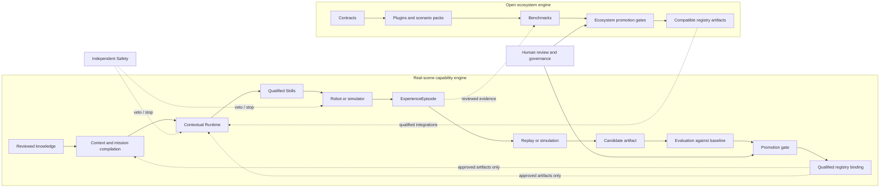

# Longship North Star: Physical Intelligence Co-Evolution

> **Status:** Long-term vision and design thesis. This document describes the
> direction Longship is building toward. It does not claim that the six-layer
> platform, autonomous evolution pipeline, production speech, navigation, or
> real-hardware qualification is implemented today.

For the current runnable scope, see the [project README](../../README.md). For
technical responsibility boundaries, see
[System Architecture v2](../architecture/system-architecture-v2.md) and
[Skills, Runtime, Navigation, and Target Boundaries](../architecture/skills-and-runtime.md).

## Purpose

Longship aims to help embodied systems turn human intent into safe, verifiable
physical capability, and turn each execution into evidence that improves future
capability.

The objective is not to collect the largest archive of robot data. It is to
increase the value of each physical interaction by preserving its context,
decisions, outcomes, failures, recovery, and reproducibility. We call this
**experience efficiency**: how much safe, reusable capability can be gained
from a bounded amount of physical experience.

The long-term loop is:

```text
reviewed knowledge and current context
  -> executable mission
  -> bounded Skills
  -> safe physical execution
  -> structured experience
  -> replay and evaluation
  -> reviewed capability update
```

Longship should remain compatible with changing foundation models, robot
embodiments, simulators, navigation stacks, and policy frameworks. Its durable
assets are the contracts, Runtime behavior, Skill qualifications, safety
boundaries, structured experience, and evaluation evidence that connect those
components.

## Current Reality

Longship is currently a foundation-stage open project, not a complete
co-evolution platform. The repository includes an experimental Voice Tour
vertical slice with a deterministic tour state machine, local STOP and fixed
controls that bypass the Brain, an optional Codex proposal path, mock
navigation, a provider-neutral Jackie wake and dictation boundary, and a
disabled-by-default seam for future target integrations.

It does not yet provide a general-purpose mission scheduler, production speech
or navigation, an independent hardware safety implementation, a knowledge
compiler, a complete episode recorder, a replay service, an automated promotion
system, or real-target qualification. The North Star guides incremental work;
it must not be used to present planned components as shipped capability.

## From an Execution Harness to a Learning System

An execution harness is necessary: it starts tasks, calls capabilities, handles
timeouts, and records events. A data flywheel is also useful: it gathers more
examples from deployment. Neither is sufficient on its own.

Physical experience becomes reusable only when the system can answer:

- What goal, constraints, knowledge, and world state shaped this attempt?
- Which versions of the Skill, provider, model, map, configuration, and target
  were used?
- What actually happened, and which evidence supports that account?
- Was a proposed explanation reproduced, or is it still only a hypothesis?
- Did a candidate improvement beat a declared baseline without breaking
  existing behavior?
- Who approved the change, where is it qualified, and how can it be rolled
  back?

Longship therefore aims to become a **physical-intelligence co-evolution
system**: a platform in which deployment and improvement share contracts and
evidence, while remaining separated by safety and promotion gates.

## Two Strategic Engines

The target platform has two connected engines:



The **real-scene capability engine** connects deployment with offline replay
and evaluation. Live execution is optimized for bounded latency, deterministic
state, clear authority, and safe degradation. Offline improvement may use
slower analysis, simulation, training, or model-assisted development; it never
sits in the real-time control path and cannot promote its own output.

The **open ecosystem engine** lets contributors build against shared contracts,
publish compatible plugins and scenario packs, and compare them through common
benchmarks and gates. Reviewed, privacy- and license-compatible evidence may
also inform external model research. It does not automatically modify Codex or
any other foundation model.

The `ExperienceEpisode` is the evidence boundary between live execution,
offline improvement, and any approved ecosystem contribution. It is not a bag
of logs and it is not automatically training data. It is a structured,
versioned index that makes an execution inspectable and, where possible,
reproducible.

## Six Responsibility Layers

The six layers below are ownership boundaries, not a serial pipeline that every
task traverses on every control cycle.

| Layer | Responsibility | Explicit boundary |
| --- | --- | --- |
| 1. Knowledge and World Interpretation | Versioned facts, reviewed rules, maps, object and human context, and source provenance | High-rate control state does not belong in prompts or document stores |
| 2. Context Compilation and Scene Teaching | Turns goals, relevant knowledge, available capabilities, and constraints into a validated mission | Model output remains an untrusted draft until deterministic checks pass |
| 3. Contextual Physical Runtime | Owns mission state, task graphs, resources, concurrency, versions, timeouts, cancellation, switching, and recovery | Runtime schedules algorithms; it does not implement navigation, speech, manipulation, or controller mathematics |
| 4. Skills and Policies | Implements bounded semantic capabilities through classical algorithms, state machines, learned policies, or embodied models | A Skill cannot grant itself global authority or bypass Runtime and Safety |
| 5. Simulation, Replay, and Candidate Evolution | Reproduces failures and evaluates candidate rules, parameters, Skills, and models | Candidate generation stays outside the real-time path and cannot deploy itself |
| 6. Execution, Evaluation, and Experience Distillation | Captures outcomes, evidence, failure classifications, recovery results, and qualification decisions | Raw logs alone are not experience, and simulation success is not real-target qualification |

Safety, observability, privacy, artifact provenance, and governance cut across
all six layers.

## Two Connected Operational Loops

### Online mission loop

The online loop must remain bounded and responsive:

```text
voice / keyboard / authorized API
  -> deterministic input classification
  -> fixed control or semantic goal
  -> bounded context
  -> Brain proposal when needed
  -> contract and policy validation
  -> Runtime scheduling
  -> qualified Skills
  -> arbitration and independent Safety
  -> robot or simulator
  -> state, events, and evidence
```

STOP and other reserved safety controls must not wait for a foundation model.
Pause, cancel, status, and other fixed controls should also take a deterministic
local path. High-level AI is event-driven; it should not receive every
high-rate sensor sample or participate in motor timing.

The Brain receives a bounded snapshot of current mission state, relevant
knowledge, available Skills, material recent events, and selected historical
summaries. A provider's conversation history is not canonical robot memory.

### Offline improvement loop

The offline loop converts evidence into candidates without granting those
candidates production authority:

```text
selected ExperienceEpisodes
  -> failure grouping and replay
  -> root-cause hypotheses
  -> deterministic reproduction or simulation
  -> candidate rule, configuration, Skill, or model
  -> baseline and regression comparison
  -> promotion gates and required human review
  -> canary deployment with rollback
  -> new execution evidence
```

A failure may correctly lead to no change. An unreproduced explanation remains
a hypothesis. A candidate that fixes one case but regresses established
behavior must be rejected.

## Authority and Replaceability

Longship should reuse general models rather than build a new universal Brain.
Codex is the public reference high-level Brain, but the contract should permit
other language or multimodal models. Embodied models, locomotion frameworks,
navigation systems, and classical controllers can be integrated as bounded
providers behind Skills.

The authority boundary is stable even when implementations change:

- A **Brain** interprets open-ended goals, explains state, and proposes
  high-level actions or recovery. Its output has no actuator authority.
- A deterministic **compiler and policy gate** turns an accepted proposal into
  an executable, versioned `MissionContract`.
- **Runtime** owns live task state, scheduling, resource leases, concurrency,
  cancellation, timeout, handoff, and recovery.
- A **Skill** implements an operator-meaningful capability such as
  `interaction.say`, `navigation.navigate_to`, `navigation.follow_person`,
  `manipulation.pick_object`, or `manipulation.place_object`.
- A **provider** implements a Skill using a replaceable algorithm, stack, or
  model. A **target adapter** translates approved commands for a simulator,
  middleware, or robot.
- **Safety** independently limits, vetoes, or stops physical execution.

A Skill is more than a callable function. Its contract should declare typed
inputs and results, versions, preconditions, resources, timeout and
cancellation behavior, safe points, evidence, risk, authorization, and target
qualification scope.

## Knowledge at Different Time Scales

Longship should not place all information in one memory store or one model
context. Different knowledge has different owners and lifetimes:

| Time scale | Examples | Canonical owner |
| --- | --- | --- |
| Milliseconds to seconds | Joint state, target feedback, obstacle freshness, safety state | World State and Safety |
| Seconds to minutes | Mission phase, active resources, pending actions, recent material events | Runtime task state |
| Days to months | Site rules, maps, object semantics, operating procedures | Reviewed Knowledge |
| Across releases | Qualified Skill bindings, model and artifact versions, benchmark evidence | Registry and Evaluation |
| Across deployments | Validated lessons and reusable failure patterns | Experience and Knowledge, with review status |

Context compilation retrieves only what a decision needs. Long histories,
video, telemetry, and raw logs remain outside the prompt and are referenced by
stable identifiers.

## ExperienceEpisode and Truth Levels

An `ExperienceEpisode` identifies what was attempted and the evidence available
for evaluating it. It should bind the mission, session, target, Skill versions,
provider and model bindings, maps, knowledge artifacts, configuration, code
revision, outcome, recovery, and privacy classification.

It must keep five epistemic levels separate:

1. **Evidence references** point to immutable video, telemetry, logs, replay
   seeds, maps, or other external artifacts, including digests and retention
   policy.
2. **Observations** are timestamped claims from identified sensors or Runtime
   components, including units, frame, confidence, freshness, and provenance.
3. **Derived metrics** are recomputable values such as stop latency, route
   deviation, task duration, or payload tilt, together with evaluator version.
4. **Hypotheses** are candidate explanations or recovery ideas from a human,
   model, or analysis tool. They are not trusted knowledge.
5. **Validated lessons** are conclusions supported by reproducible evaluation,
   a declared baseline, an applicability scope, and the required review.

This separation prevents a plausible model explanation from silently becoming
a fact. It also allows metrics to be recomputed when an evaluator improves.

## Promotion and Safety

Co-evolution does not mean online self-modification. A candidate may enter a
deployment only when:

- relevant artifacts are immutable and content-addressed;
- the evaluation environment and baseline are declared;
- success criteria and regression limits are defined before comparison;
- failure, cancellation, and degraded-mode behavior are tested;
- multiple seeds or representative cases are used where nondeterminism matters;
- target-specific qualification is complete for physical actuation;
- safety-relevant changes receive the required human approval;
- deployment is bounded by a canary policy; and
- a known rollback target remains available.

Qualification applies to a complete binding, not to a Skill name in isolation:

```text
Skill contract
+ implementation
+ provider configuration
+ model, map, or motion artifacts
+ target adapter and target profile
+ Safety profile
+ evaluation evidence
```

Passing replay or simulation does not automatically qualify a physical robot.
The independent Safety path must remain effective when the Brain, network,
dashboard, speech system, or Runtime extension fails.

## Open Ecosystem and Artifact Boundaries

Longship starts as one public monorepo so contracts, reference behavior,
scenarios, and tests can evolve together. The public project should contain:

- stable contracts and small reference implementations;
- Runtime and safety integration boundaries;
- plugin SDKs, manifests, compatibility rules, and mock providers;
- compact scenarios, replay fixtures, benchmarks, and qualification reports;
- documentation that states both capabilities and limitations honestly.

Large model weights, maps, datasets, videos, logs, and generated evaluation
media belong in external artifact storage. The repository stores manifests,
content hashes, licenses, provenance, compatibility, and retrieval instructions.
Sensitive deployment evidence remains private or redacted according to its
policy; public contribution is never a reason to expose unauthorized data.

Longship may eventually produce reviewed, privacy- and license-compatible
evaluation or training artifacts that inform model development. It must not
assume that structured robot experience can automatically update Codex or any
third-party foundation model.

## Measures of Progress

Longship should optimize learning, safety, and reuse rather than raw data
volume. Useful measures include:

- **Time to Skill** -- elapsed engineering time from a defined task contract to
  passing its declared qualification gate.
- **Experience Efficiency** -- newly covered failure classes or accepted
  performance improvements per fixed number of qualifying episodes.
- **Reproduction Rate** -- selected failures that can be deterministically
  replayed or represented by a validated simulation case.
- **Knowledge Reuse Rate** -- qualified scenarios, targets, or Skills that
  reuse a reviewed rule or lesson.
- **Scenario Expansion Cost** -- effort to support a new site, task variant, or
  target without rebuilding the stack.
- **Human Review Hours per Failure** -- expert time needed to locate evidence,
  reproduce behavior, assess a hypothesis, and reach a decision.
- **Regression Escape Rate** -- promoted changes later found to violate an
  existing gate.
- **Rollback Readiness** -- production bindings with a verified rollback target
  and procedure.

Robot count, runtime hours, and stored bytes may be useful operational
statistics, but they are not sufficient measures of capability growth.

## Incremental Roadmap

The six layers should guide the design, not become six simultaneous projects.
Longship should first close one small, trustworthy loop.

### 1. Close the Voice Tour loop

Use the existing Voice Tour vertical slice to stabilize only the minimum
contracts needed for:

- one reviewed site rule and a two-stop mission;
- `interaction.say` and `navigation.navigate_to` Skills, plus an independent
  reserved `SafetyStopRequest` path;
- resource-safe overlap of speech and mock motion;
- bounded cancellation and timeout behavior;
- authoritative Runtime events;
- deterministic failure injection; and
- automatic `ExperienceEpisode` generation.

A blocked route, stale localization state, cancelled mission, and successful
tour should all be reproducible and inspectable.

### 2. Add replay and one promotion gate

Replay the same episode and seed against a declared baseline. Evaluate one
narrow candidate, such as a route policy or timeout configuration. Prove that
Longship can capture a failure, reproduce it, compare a candidate, detect
regressions, and record a reviewable promotion decision.

### 3. Qualify supervised Follow Me on one physical target

Use `navigation.follow_person` as the first mobile physical slice. Connect one
tracking and locomotion provider behind the existing interfaces, then qualify
tracking-loss behavior, base-resource arbitration, target-side watchdogs,
measured stop evidence, synchronized telemetry, and an explicit Safety profile.
This phase remains supervised and does not imply general autonomy.

### 4. Add bounded waypoint navigation and prove portability

After Follow Me is bounded and reproducible, add approved-waypoint navigation
and a mobile Voice Tour. Then introduce either a second provider, a second
target, or another compact scenario such as a simple handoff task. Use the
resulting integration pressure to revise contracts before declaring them
stable.

### 5. Expand knowledge and candidate evolution

Only after repeated episodes and reliable evaluation exist should Longship add
broader knowledge compilation, failure clustering, simulation curriculum
generation, or model-assisted candidate creation.

Full box transport should be decomposed into separately qualified perception,
acquisition, load handling, navigation, placement, and recovery capabilities
rather than used as the first proof of the entire platform.

## Near-Term Non-Goals

The initial system should not attempt to build:

- a new general-purpose foundation model;
- automatic production deployment;
- unrestricted online code or model modification;
- a universal ontology for every physical task;
- production fleet management;
- a large private data lake;
- many repositories with independent release processes; or
- an ecosystem standard before one complete loop is useful to contributors.

## North-Star Outcome

Longship succeeds when a new physical task can be expressed through stable
semantic contracts, executed through qualified and replaceable capabilities,
stopped independently and safely, explained through structured evidence,
replayed without reconstructing an incident by hand, and improved through a
reviewable process that preserves existing behavior.

The project should grow by completing small, trustworthy loops: explore, learn,
build together, and keep evolving.
